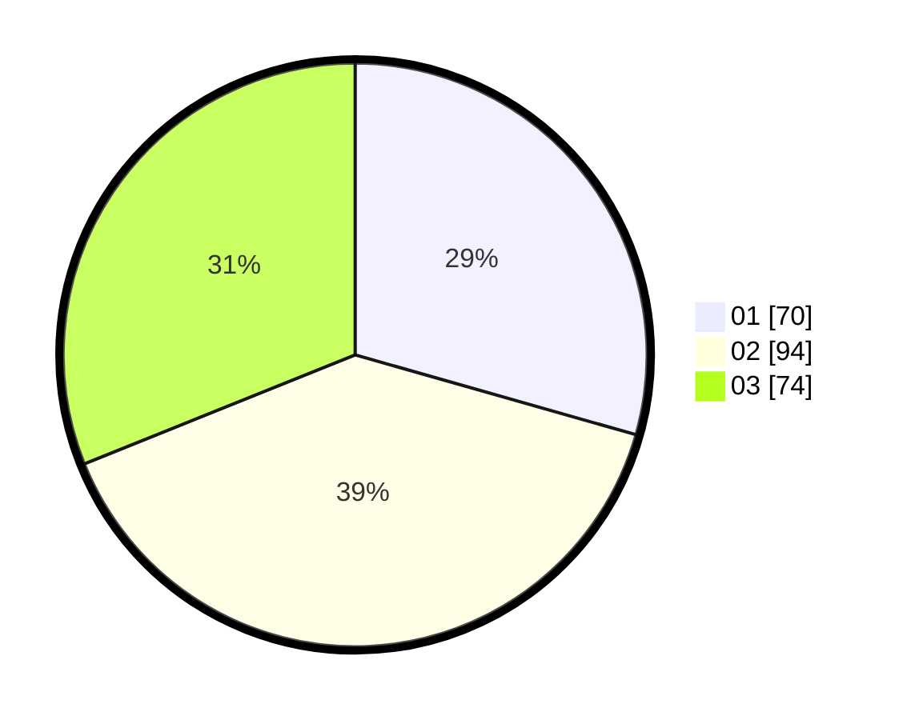

# Hasil

Hasil perolehan suara paslon dapat dilihat pada file paslon-01.txt, paslon-02.txt, dan paslon-03.txt.

Jika tidak ada, artinya data tersebut belum ada pada SIREKAP.

## Perolehan Suara

 * Paslon 01: **70**.
 * Paslon 02: **94**.
 * Paslon 03: **74**.

## Foto C Plano

https://sirekap-obj-formc.kpu.go.id/ff1e/pemilu/ppwp/31/75/07/10/04/3175071004132-20240214-155713--643d34e0-7819-47e2-93f6-02f837906295.jpg

https://sirekap-obj-formc.kpu.go.id/ff1e/pemilu/ppwp/31/75/07/10/04/3175071004132-20240214-155256--6ab93334-f34c-4462-9861-2c7b6987b163.jpg

https://sirekap-obj-formc.kpu.go.id/ff1e/pemilu/ppwp/31/75/07/10/04/3175071004132-20240214-155547--5448e6aa-42b3-42a9-bdef-dd1ed97b9602.jpg

## DATA PEMILIH TETAP

Jumlah pemilih dalam DPT: **271**.
 * L: **125**.
 * P: **146**.

## DATA PENGGUNA HAK PILIH

Jumlah pengguna hak pilih dalam DPT: **205**.
 * L: **96**.
 * P: **109**.

Jumlah pengguna hak pilih dalam DPTb: **17**.
 * L: **7**.
 * P: **10**.

Jumlah pengguna hak pilih dalam DPK: **17**.
 * L: **7**.
 * P: **10**.

Jumlah pengguna hak pilih: **239**.
 * L: **110**.
 * P: **129**.

## JUMLAH SUARA SAH DAN TIDAK SAH

JUMLAH SELURUH SUARA SAH: **238**.

JUMLAH SUARA TIDAK SAH: **1**.

JUMLAH SELURUH SUARA SAH DAN SUARA TIDAK SAH: **239**.
