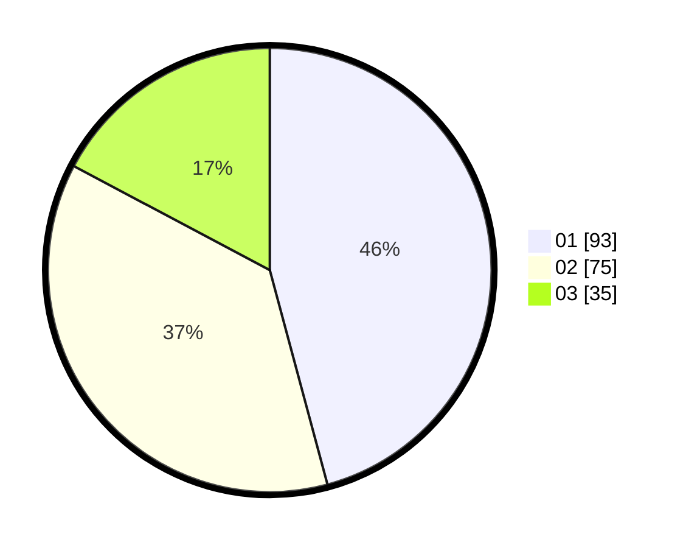

# Hasil

Hasil perolehan suara paslon dapat dilihat pada file paslon-01.txt, paslon-02.txt, dan paslon-03.txt.

Jika tidak ada, artinya data tersebut belum ada pada SIREKAP.

## Perolehan Suara

 * Paslon 01: **93**.
 * Paslon 02: **75**.
 * Paslon 03: **35**.

## Foto C Plano

https://sirekap-obj-formc.kpu.go.id/2579/pemilu/ppwp/31/75/07/10/04/3175071004135-20240217-110321--1d6b8baa-9bcd-48f2-9c54-5ac76ad1605a.jpg

https://sirekap-obj-formc.kpu.go.id/2579/pemilu/ppwp/31/75/07/10/04/3175071004135-20240215-205924--444777cd-ec7f-49bf-9514-f79599f94b75.jpg

https://sirekap-obj-formc.kpu.go.id/2579/pemilu/ppwp/31/75/07/10/04/3175071004135-20240217-110321--314c01be-eee2-45f8-84f0-95a4fbcf3618.jpg

## DATA PEMILIH TETAP

Jumlah pemilih dalam DPT: **240**.
 * L: **123**.
 * P: **117**.

## DATA PENGGUNA HAK PILIH

Jumlah pengguna hak pilih dalam DPT: **0**.
 * L: **0**.
 * P: **0**.

Jumlah pengguna hak pilih dalam DPTb: **0**.
 * L: **0**.
 * P: **0**.

Jumlah pengguna hak pilih dalam DPK: **0**.
 * L: **0**.
 * P: **0**.

Jumlah pengguna hak pilih: **0**.
 * L: **0**.
 * P: **0**.

## JUMLAH SUARA SAH DAN TIDAK SAH

JUMLAH SELURUH SUARA SAH: **203**.

JUMLAH SUARA TIDAK SAH: **3**.

JUMLAH SELURUH SUARA SAH DAN SUARA TIDAK SAH: **206**.
