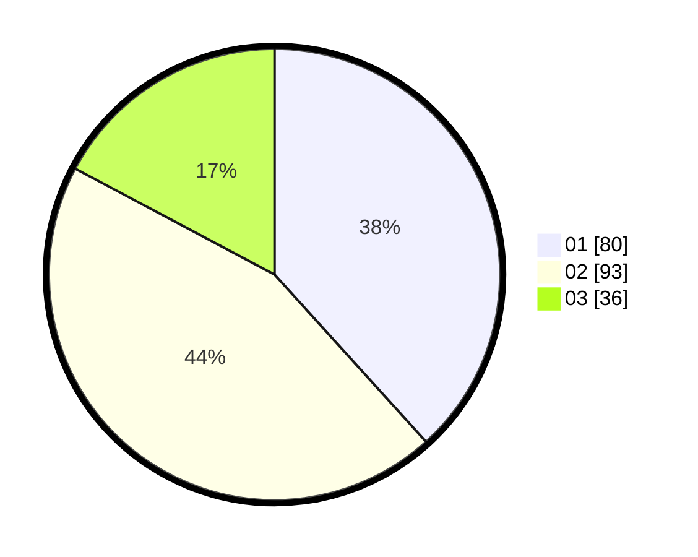

# Hasil

Hasil perolehan suara paslon dapat dilihat pada file paslon-01.txt, paslon-02.txt, dan paslon-03.txt.

Jika tidak ada, artinya data tersebut belum ada pada SIREKAP.

## Perolehan Suara

 * Paslon 01: **80**.
 * Paslon 02: **93**.
 * Paslon 03: **36**.

## Foto C Plano

https://sirekap-obj-formc.kpu.go.id/b329/pemilu/ppwp/31/75/07/10/04/3175071004137-20240214-160130--6b75dbab-f40d-4513-b4b7-b11fcbbc2096.jpg

https://sirekap-obj-formc.kpu.go.id/b329/pemilu/ppwp/31/75/07/10/04/3175071004137-20240214-160142--63728e44-1986-4b05-a20e-dd61236f87f3.jpg

https://sirekap-obj-formc.kpu.go.id/b329/pemilu/ppwp/31/75/07/10/04/3175071004137-20240214-160155--d6f52f02-79e1-4810-8da4-08691687aac7.jpg

## DATA PEMILIH TETAP

Jumlah pemilih dalam DPT: **208**.
 * L: **93**.
 * P: **115**.

## DATA PENGGUNA HAK PILIH

Jumlah pengguna hak pilih dalam DPT: **208**.
 * L: **93**.
 * P: **115**.

Jumlah pengguna hak pilih dalam DPTb: **0**.
 * L: **0**.
 * P: **0**.

Jumlah pengguna hak pilih dalam DPK: **1**.
 * L: **1**.
 * P: **0**.

Jumlah pengguna hak pilih: **209**.
 * L: **94**.
 * P: **115**.

## JUMLAH SUARA SAH DAN TIDAK SAH

JUMLAH SELURUH SUARA SAH: **209**.

JUMLAH SUARA TIDAK SAH: **0**.

JUMLAH SELURUH SUARA SAH DAN SUARA TIDAK SAH: **209**.
