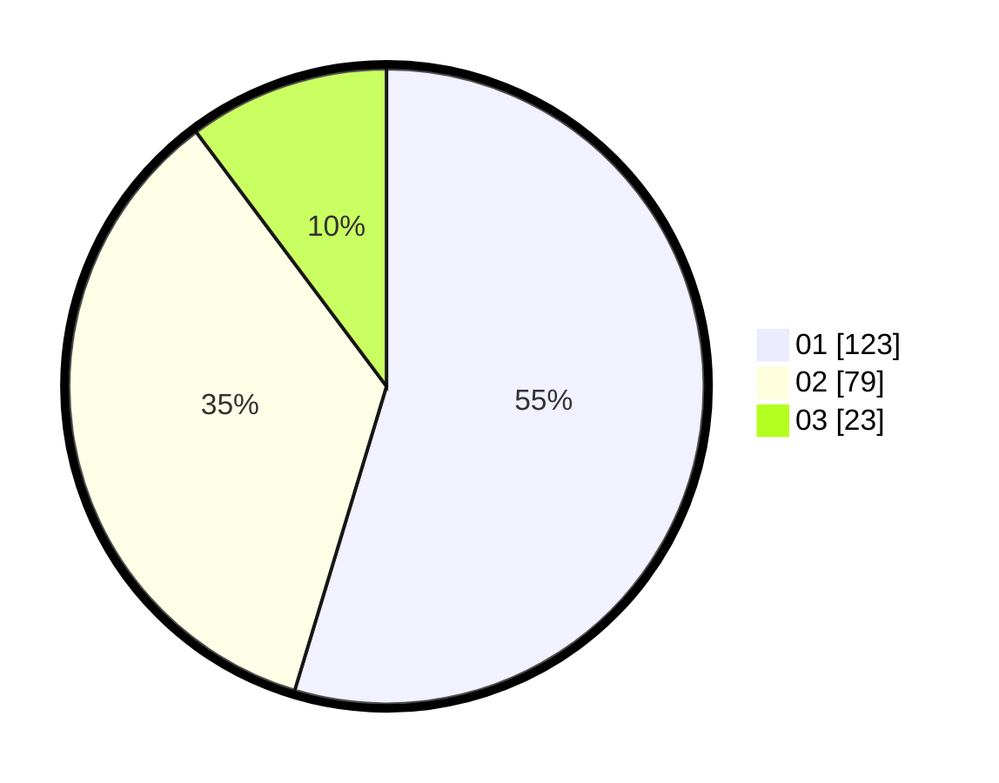

# Hasil

Hasil perolehan suara paslon dapat dilihat pada file paslon-01.txt, paslon-02.txt, dan paslon-03.txt.

Jika tidak ada, artinya data tersebut belum ada pada SIREKAP.

## Perolehan Suara

 * Paslon 01: **123**.
 * Paslon 02: **79**.
 * Paslon 03: **23**.

## Foto C Plano

https://sirekap-obj-formc.kpu.go.id/e646/pemilu/ppwp/31/75/07/10/04/3175071004140-20240214-194158--f5a1a91e-b996-4018-b38d-170e122a1595.jpg

https://sirekap-obj-formc.kpu.go.id/e646/pemilu/ppwp/31/75/07/10/04/3175071004140-20240214-194327--27b4eadf-0cbd-41ae-851e-ea6decee8f15.jpg

https://sirekap-obj-formc.kpu.go.id/e646/pemilu/ppwp/31/75/07/10/04/3175071004140-20240214-194418--d9741e1a-18ad-401a-8919-4f04abdde619.jpg
