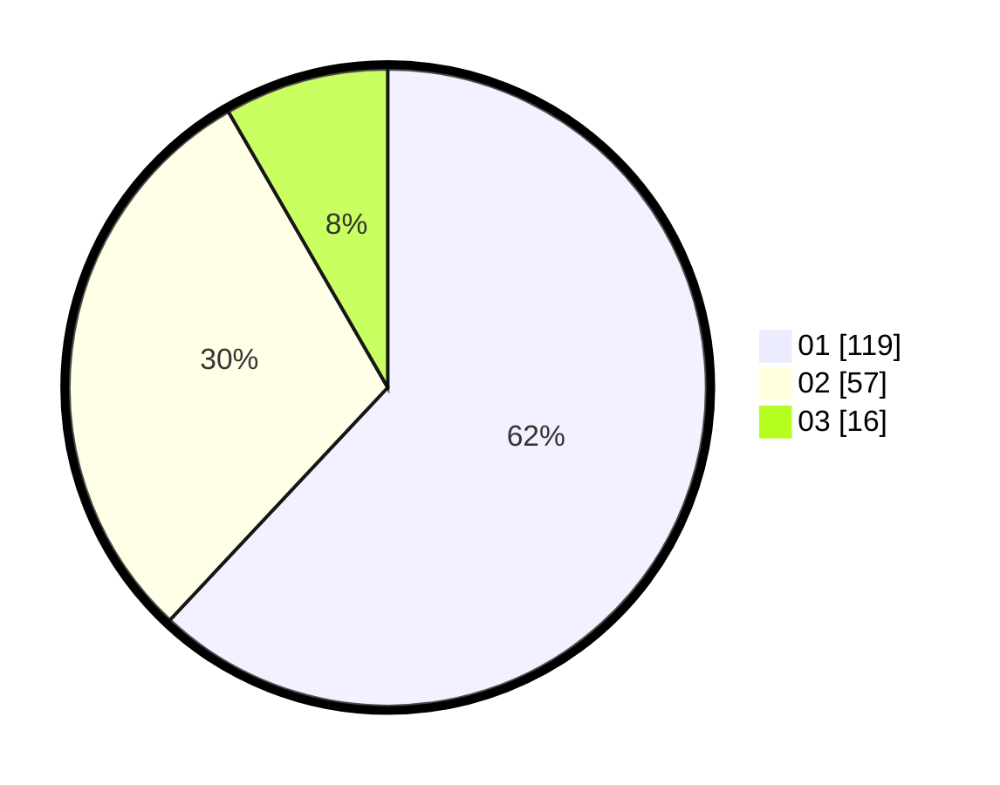

# Hasil

Hasil perolehan suara paslon dapat dilihat pada file paslon-01.txt, paslon-02.txt, dan paslon-03.txt.

Jika tidak ada, artinya data tersebut belum ada pada SIREKAP.

## Perolehan Suara

 * Paslon 01: **119**.
 * Paslon 02: **57**.
 * Paslon 03: **16**.

## Foto C Plano

https://sirekap-obj-formc.kpu.go.id/2c26/pemilu/ppwp/31/75/07/10/04/3175071004151-20240214-232924--bba4c55e-9025-4401-af0b-78b2ab3a6301.jpg

https://sirekap-obj-formc.kpu.go.id/2c26/pemilu/ppwp/31/75/07/10/04/3175071004151-20240214-232957--bf92974c-5879-41b7-88cc-3891305780f1.jpg

https://sirekap-obj-formc.kpu.go.id/2c26/pemilu/ppwp/31/75/07/10/04/3175071004151-20240214-233058--a3486cdf-44d6-45b1-af5b-ccea50bd27dc.jpg

## DATA PEMILIH TETAP

Jumlah pemilih dalam DPT: **219**.
 * L: **115**.
 * P: **104**.

## DATA PENGGUNA HAK PILIH

Jumlah pengguna hak pilih dalam DPT: **188**.
 * L: **98**.
 * P: **90**.

Jumlah pengguna hak pilih dalam DPTb: **3**.
 * L: **2**.
 * P: **1**.

Jumlah pengguna hak pilih dalam DPK: **3**.
 * L: **2**.
 * P: **1**.

Jumlah pengguna hak pilih: **194**.
 * L: **102**.
 * P: **92**.

## JUMLAH SUARA SAH DAN TIDAK SAH

JUMLAH SELURUH SUARA SAH: **192**.

JUMLAH SUARA TIDAK SAH: **2**.

JUMLAH SELURUH SUARA SAH DAN SUARA TIDAK SAH: **194**.
