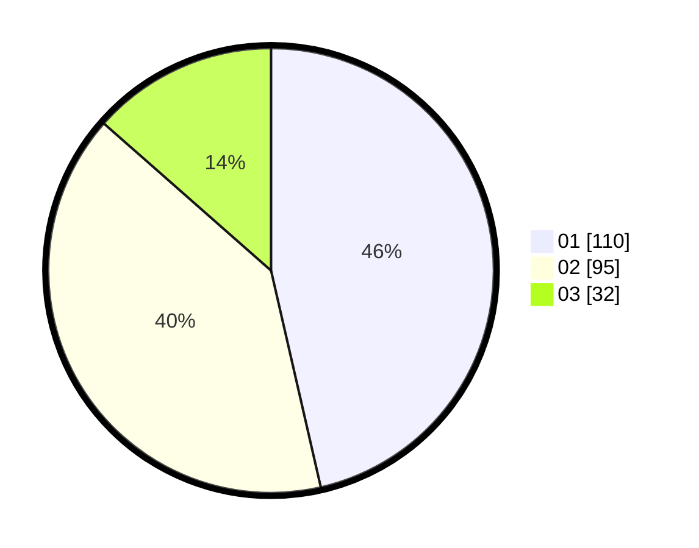

# Hasil

Hasil perolehan suara paslon dapat dilihat pada file paslon-01.txt, paslon-02.txt, dan paslon-03.txt.

Jika tidak ada, artinya data tersebut belum ada pada SIREKAP.

## Perolehan Suara

 * Paslon 01: **110**.
 * Paslon 02: **95**.
 * Paslon 03: **32**.

## Foto C Plano

https://sirekap-obj-formc.kpu.go.id/f802/pemilu/ppwp/31/75/07/10/04/3175071004163-20240215-011317--9d2e9f48-1f86-4ec3-a11d-21d9b5a29feb.jpg

https://sirekap-obj-formc.kpu.go.id/f802/pemilu/ppwp/31/75/07/10/04/3175071004163-20240215-011349--021dc3b6-a100-4120-8689-8b716521b75a.jpg

https://sirekap-obj-formc.kpu.go.id/f802/pemilu/ppwp/31/75/07/10/04/3175071004163-20240215-011415--4f821632-0300-4801-9ac1-70d3f18243cd.jpg
