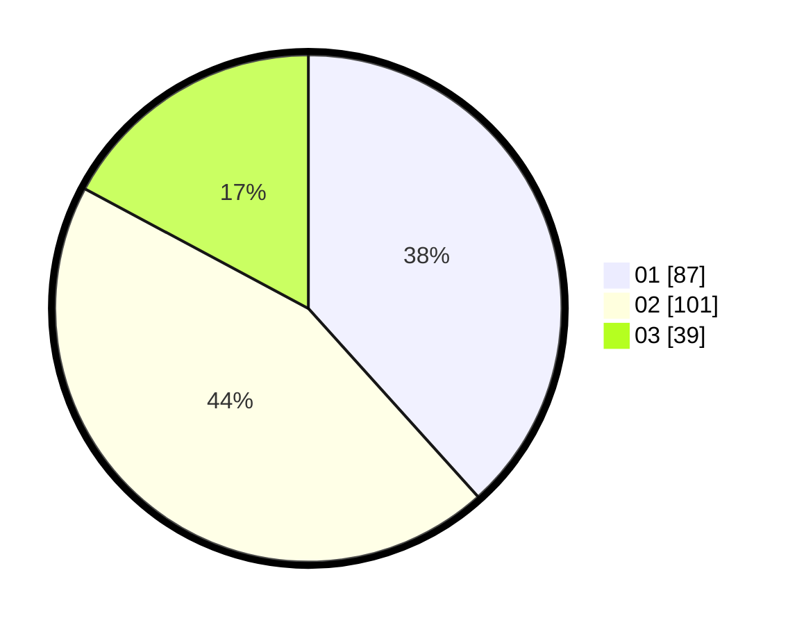

# Hasil

Hasil perolehan suara paslon dapat dilihat pada file paslon-01.txt, paslon-02.txt, dan paslon-03.txt.

Jika tidak ada, artinya data tersebut belum ada pada SIREKAP.

## Perolehan Suara

 * Paslon 01: **87**.
 * Paslon 02: **101**.
 * Paslon 03: **39**.

## Foto C Plano

https://sirekap-obj-formc.kpu.go.id/d953/pemilu/ppwp/31/75/07/10/04/3175071004170-20240214-191708--c9b1f060-2421-4091-b70a-9c8e2affa792.jpg

https://sirekap-obj-formc.kpu.go.id/d953/pemilu/ppwp/31/75/07/10/04/3175071004170-20240214-191714--f741c67d-15d1-4662-8657-2163abbc6571.jpg

https://sirekap-obj-formc.kpu.go.id/d953/pemilu/ppwp/31/75/07/10/04/3175071004170-20240214-191719--80b34aed-d365-4fbf-b7f2-fe7ed68ff840.jpg

## DATA PEMILIH TETAP

Jumlah pemilih dalam DPT: **281**.
 * L: **134**.
 * P: **147**.

## DATA PENGGUNA HAK PILIH

Jumlah pengguna hak pilih dalam DPT: **225**.
 * L: **103**.
 * P: **122**.

Jumlah pengguna hak pilih dalam DPTb: **2**.
 * L: **1**.
 * P: **1**.

Jumlah pengguna hak pilih dalam DPK: **2**.
 * L: **1**.
 * P: **1**.

Jumlah pengguna hak pilih: **229**.
 * L: **105**.
 * P: **124**.

## JUMLAH SUARA SAH DAN TIDAK SAH

JUMLAH SELURUH SUARA SAH: **227**.

JUMLAH SUARA TIDAK SAH: **2**.

JUMLAH SELURUH SUARA SAH DAN SUARA TIDAK SAH: **229**.
