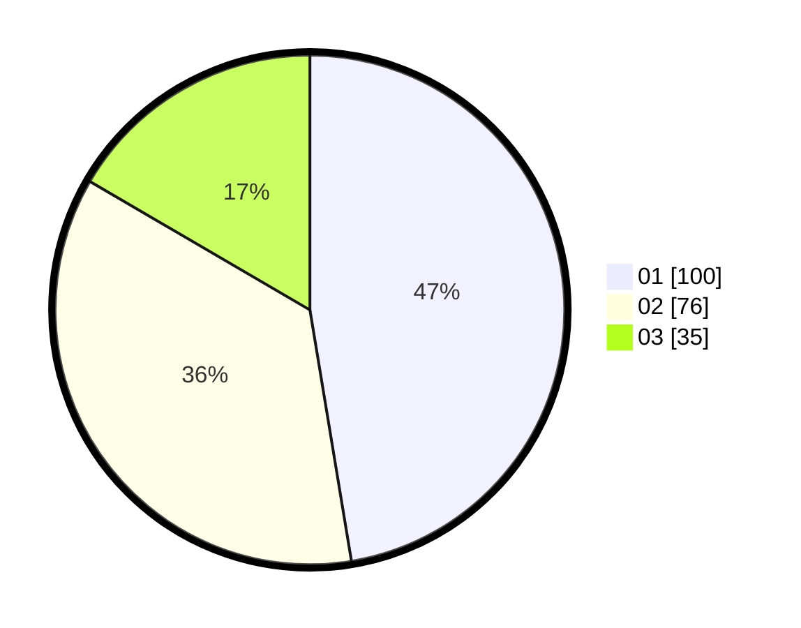

# Hasil

Hasil perolehan suara paslon dapat dilihat pada file paslon-01.txt, paslon-02.txt, dan paslon-03.txt.

Jika tidak ada, artinya data tersebut belum ada pada SIREKAP.

## Perolehan Suara

 * Paslon 01: **100**.
 * Paslon 02: **76**.
 * Paslon 03: **35**.

## Foto C Plano

https://sirekap-obj-formc.kpu.go.id/a183/pemilu/ppwp/31/75/07/10/04/3175071004172-20240215-022341--5fe484c9-bea4-4e99-86a6-d54e726afc7d.jpg

https://sirekap-obj-formc.kpu.go.id/a183/pemilu/ppwp/31/75/07/10/04/3175071004172-20240215-022346--b616b1cc-7d7d-4cbe-ab46-3c753e3d8a08.jpg

https://sirekap-obj-formc.kpu.go.id/a183/pemilu/ppwp/31/75/07/10/04/3175071004172-20240215-022422--82212b0e-e4a0-4817-b14e-5e2da7707b4e.jpg
