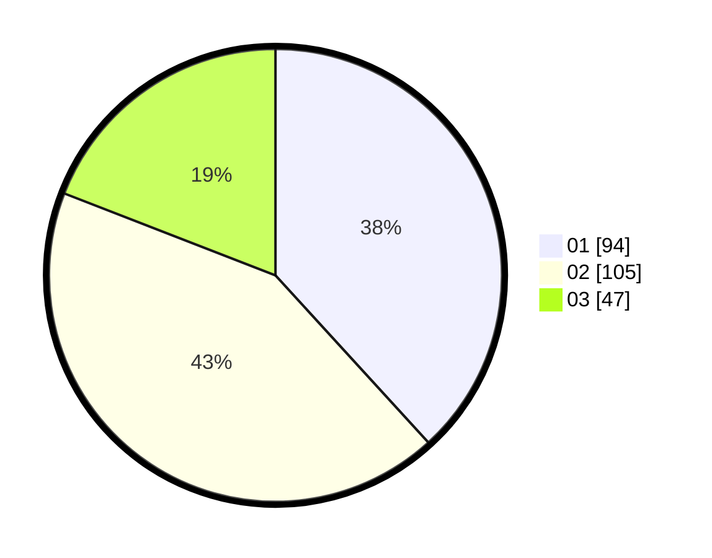

# Hasil

Hasil perolehan suara paslon dapat dilihat pada file paslon-01.txt, paslon-02.txt, dan paslon-03.txt.

Jika tidak ada, artinya data tersebut belum ada pada SIREKAP.

## Perolehan Suara

 * Paslon 01: **94**.
 * Paslon 02: **105**.
 * Paslon 03: **47**.

## Foto C Plano

https://sirekap-obj-formc.kpu.go.id/6e48/pemilu/ppwp/31/75/07/10/04/3175071004175-20240214-184439--9549d008-6353-4863-a4b5-17c06bac5da8.jpg

https://sirekap-obj-formc.kpu.go.id/6e48/pemilu/ppwp/31/75/07/10/04/3175071004175-20240214-184528--fe7bf9f9-b523-4b1c-b059-c44750bad9f2.jpg

https://sirekap-obj-formc.kpu.go.id/6e48/pemilu/ppwp/31/75/07/10/04/3175071004175-20240214-185310--ad2b1ad5-936c-4d58-a773-b967d77cb3fb.jpg

## DATA PEMILIH TETAP

Jumlah pemilih dalam DPT: **294**.
 * L: **137**.
 * P: **157**.

## DATA PENGGUNA HAK PILIH

Jumlah pengguna hak pilih dalam DPT: **253**.
 * L: **113**.
 * P: **140**.

Jumlah pengguna hak pilih dalam DPTb: **0**.
 * L: **0**.
 * P: **0**.

Jumlah pengguna hak pilih dalam DPK: **0**.
 * L: **0**.
 * P: **0**.

Jumlah pengguna hak pilih: **253**.
 * L: **113**.
 * P: **140**.

## JUMLAH SUARA SAH DAN TIDAK SAH

JUMLAH SELURUH SUARA SAH: **246**.

JUMLAH SUARA TIDAK SAH: **7**.

JUMLAH SELURUH SUARA SAH DAN SUARA TIDAK SAH: **253**.
