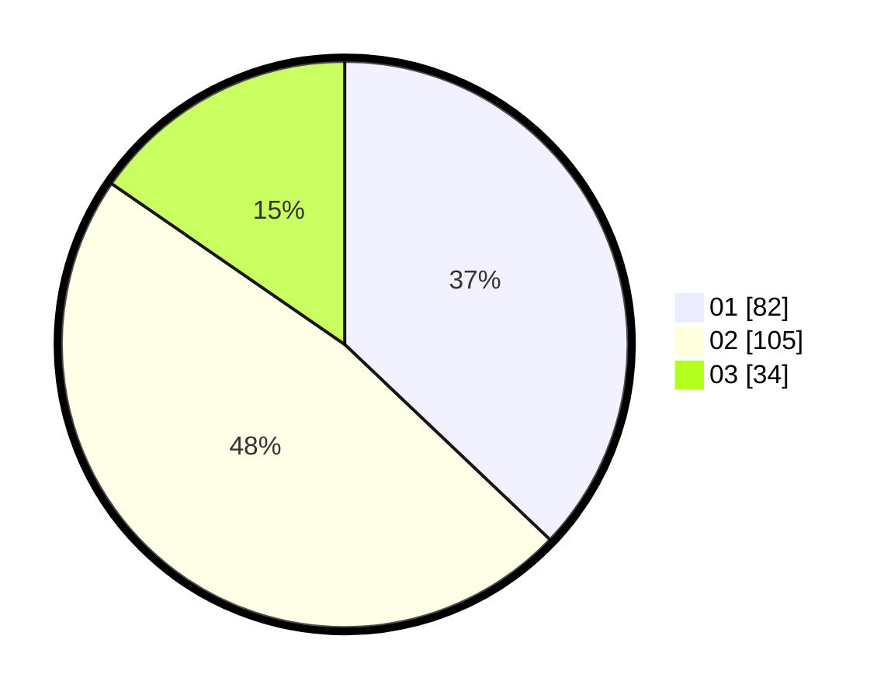

# Hasil

Hasil perolehan suara paslon dapat dilihat pada file paslon-01.txt, paslon-02.txt, dan paslon-03.txt.

Jika tidak ada, artinya data tersebut belum ada pada SIREKAP.

## Perolehan Suara

 * Paslon 01: **82**.
 * Paslon 02: **105**.
 * Paslon 03: **34**.

## Foto C Plano

https://sirekap-obj-formc.kpu.go.id/373b/pemilu/ppwp/31/75/07/10/04/3175071004176-20240214-185107--44459ad8-f66b-4efb-81d1-c94042bab2ee.jpg

https://sirekap-obj-formc.kpu.go.id/373b/pemilu/ppwp/31/75/07/10/04/3175071004176-20240214-212145--65baeeff-5f61-42fc-9d81-3d6954fa20ae.jpg

https://sirekap-obj-formc.kpu.go.id/373b/pemilu/ppwp/31/75/07/10/04/3175071004176-20240214-194129--078dec8a-ad7b-441e-bfe9-50befe3916ee.jpg

## DATA PEMILIH TETAP

Jumlah pemilih dalam DPT: **279**.
 * L: **129**.
 * P: **150**.

## DATA PENGGUNA HAK PILIH

Jumlah pengguna hak pilih dalam DPT: **218**.
 * L: **102**.
 * P: **116**.

Jumlah pengguna hak pilih dalam DPTb: **4**.
 * L: **1**.
 * P: **3**.

Jumlah pengguna hak pilih dalam DPK: **4**.
 * L: **1**.
 * P: **3**.

Jumlah pengguna hak pilih: **226**.
 * L: **104**.
 * P: **122**.

## JUMLAH SUARA SAH DAN TIDAK SAH

JUMLAH SELURUH SUARA SAH: **221**.

JUMLAH SUARA TIDAK SAH: **5**.

JUMLAH SELURUH SUARA SAH DAN SUARA TIDAK SAH: **226**.
