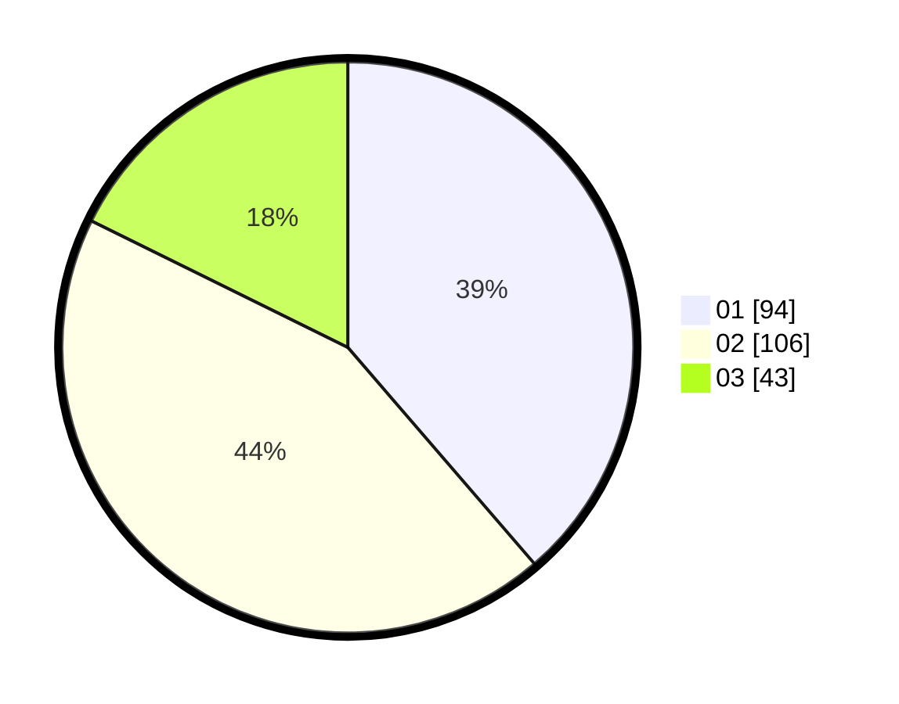

# Hasil

Hasil perolehan suara paslon dapat dilihat pada file paslon-01.txt, paslon-02.txt, dan paslon-03.txt.

Jika tidak ada, artinya data tersebut belum ada pada SIREKAP.

## Perolehan Suara

 * Paslon 01: **94**.
 * Paslon 02: **106**.
 * Paslon 03: **43**.

## Foto C Plano

https://sirekap-obj-formc.kpu.go.id/3f48/pemilu/ppwp/31/75/07/10/04/3175071004177-20240216-083314--92e15325-9bc5-4fb5-8de8-27fdd1da5f66.jpg

https://sirekap-obj-formc.kpu.go.id/3f48/pemilu/ppwp/31/75/07/10/04/3175071004177-20240216-083325--95a1495d-e58d-414f-986c-30b4b311ba26.jpg

https://sirekap-obj-formc.kpu.go.id/3f48/pemilu/ppwp/31/75/07/10/04/3175071004177-20240216-142650--ba8845a5-7f88-4279-8dc3-cac81dd8c905.jpg

## DATA PEMILIH TETAP

Jumlah pemilih dalam DPT: **284**.
 * L: **133**.
 * P: **151**.

## DATA PENGGUNA HAK PILIH

Jumlah pengguna hak pilih dalam DPT: **221**.
 * L: **106**.
 * P: **115**.

Jumlah pengguna hak pilih dalam DPTb: **5**.
 * L: **3**.
 * P: **2**.

Jumlah pengguna hak pilih dalam DPK: **19**.
 * L: **6**.
 * P: **13**.

Jumlah pengguna hak pilih: **245**.
 * L: **115**.
 * P: **130**.

## JUMLAH SUARA SAH DAN TIDAK SAH

JUMLAH SELURUH SUARA SAH: **243**.

JUMLAH SUARA TIDAK SAH: **2**.

JUMLAH SELURUH SUARA SAH DAN SUARA TIDAK SAH: **245**.
