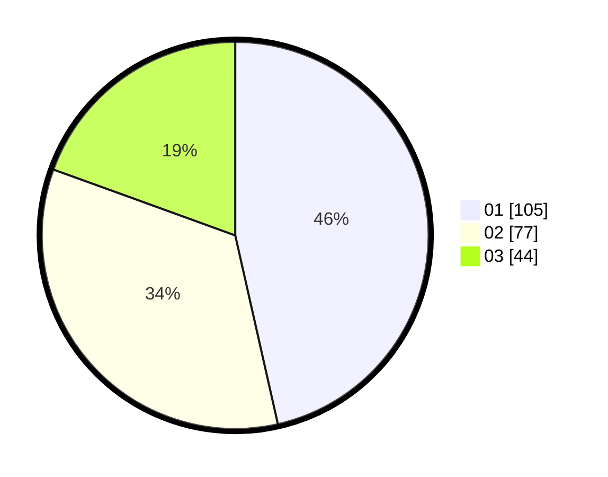

# Hasil

Hasil perolehan suara paslon dapat dilihat pada file paslon-01.txt, paslon-02.txt, dan paslon-03.txt.

Jika tidak ada, artinya data tersebut belum ada pada SIREKAP.

## Perolehan Suara

 * Paslon 01: **105**.
 * Paslon 02: **77**.
 * Paslon 03: **44**.

## Foto C Plano

https://sirekap-obj-formc.kpu.go.id/aee8/pemilu/ppwp/31/75/07/10/04/3175071004178-20240214-185928--d4b26d78-0b1f-49e7-a018-cfefbfe19cce.jpg

https://sirekap-obj-formc.kpu.go.id/aee8/pemilu/ppwp/31/75/07/10/04/3175071004178-20240214-192031--a886d7e6-368a-4cd0-b004-8454ed604fba.jpg

https://sirekap-obj-formc.kpu.go.id/aee8/pemilu/ppwp/31/75/07/10/04/3175071004178-20240214-200102--562319ac-b340-4fe0-8516-6e0425f12fd1.jpg

## DATA PEMILIH TETAP

Jumlah pemilih dalam DPT: **280**.
 * L: **143**.
 * P: **137**.

## DATA PENGGUNA HAK PILIH

Jumlah pengguna hak pilih dalam DPT: **228**.
 * L: **114**.
 * P: **114**.

Jumlah pengguna hak pilih dalam DPTb: **1**.
 * L: **0**.
 * P: **1**.

Jumlah pengguna hak pilih dalam DPK: **0**.
 * L: **0**.
 * P: **0**.

Jumlah pengguna hak pilih: **229**.
 * L: **114**.
 * P: **115**.

## JUMLAH SUARA SAH DAN TIDAK SAH

JUMLAH SELURUH SUARA SAH: **226**.

JUMLAH SUARA TIDAK SAH: **3**.

JUMLAH SELURUH SUARA SAH DAN SUARA TIDAK SAH: **229**.
