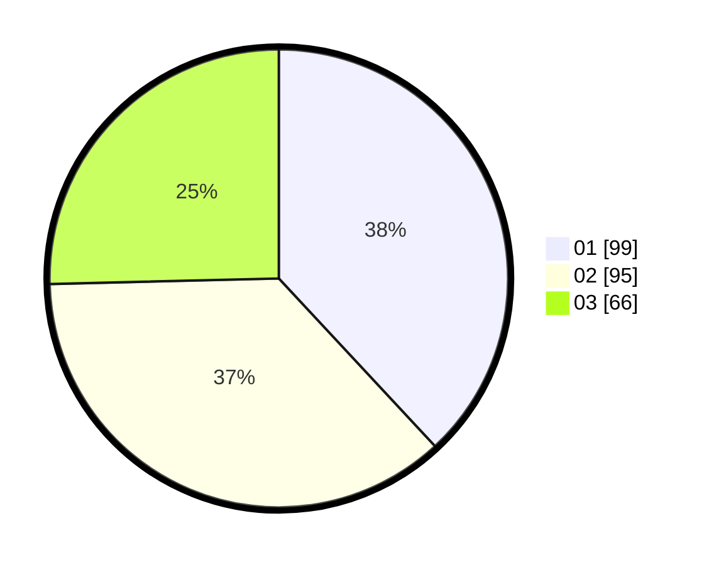

# Hasil

Hasil perolehan suara paslon dapat dilihat pada file paslon-01.txt, paslon-02.txt, dan paslon-03.txt.

Jika tidak ada, artinya data tersebut belum ada pada SIREKAP.

## Perolehan Suara

 * Paslon 01: **99**.
 * Paslon 02: **95**.
 * Paslon 03: **66**.

## Foto C Plano

https://sirekap-obj-formc.kpu.go.id/df38/pemilu/ppwp/31/75/07/10/04/3175071004180-20240214-204631--3033b7e1-d2d8-4569-b6d7-5d6e9466c83e.jpg

https://sirekap-obj-formc.kpu.go.id/df38/pemilu/ppwp/31/75/07/10/04/3175071004180-20240214-204643--8459a125-4504-4593-a7f2-fcbbc6e3aa78.jpg

https://sirekap-obj-formc.kpu.go.id/df38/pemilu/ppwp/31/75/07/10/04/3175071004180-20240214-204654--75711d8d-9497-42fb-b56f-12c1aad851d8.jpg

## DATA PEMILIH TETAP

Jumlah pemilih dalam DPT: **293**.
 * L: **126**.
 * P: **167**.

## DATA PENGGUNA HAK PILIH

Jumlah pengguna hak pilih dalam DPT: **250**.
 * L: **104**.
 * P: **146**.

Jumlah pengguna hak pilih dalam DPTb: **3**.
 * L: **1**.
 * P: **2**.

Jumlah pengguna hak pilih dalam DPK: **10**.
 * L: **5**.
 * P: **5**.

Jumlah pengguna hak pilih: **263**.
 * L: **110**.
 * P: **153**.

## JUMLAH SUARA SAH DAN TIDAK SAH

JUMLAH SELURUH SUARA SAH: **260**.

JUMLAH SUARA TIDAK SAH: **3**.

JUMLAH SELURUH SUARA SAH DAN SUARA TIDAK SAH: **263**.
