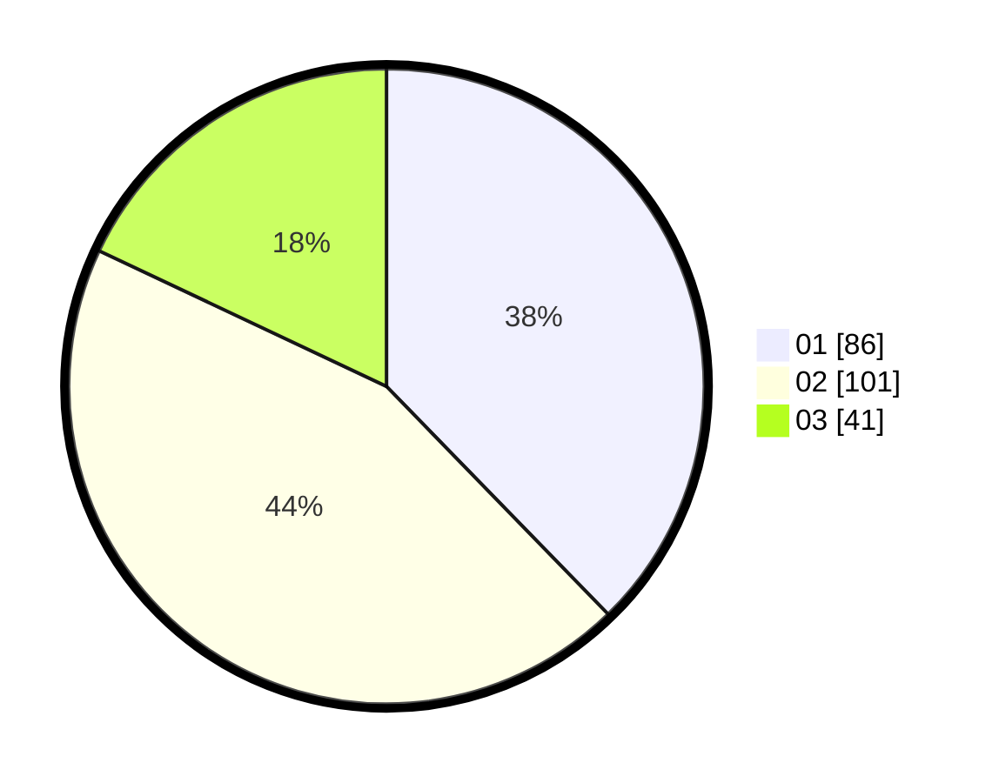

# Hasil

Hasil perolehan suara paslon dapat dilihat pada file paslon-01.txt, paslon-02.txt, dan paslon-03.txt.

Jika tidak ada, artinya data tersebut belum ada pada SIREKAP.

## Perolehan Suara

 * Paslon 01: **86**.
 * Paslon 02: **101**.
 * Paslon 03: **41**.

## Foto C Plano

https://sirekap-obj-formc.kpu.go.id/c9c0/pemilu/ppwp/31/75/07/10/04/3175071004191-20240214-155618--9945d49b-e987-4e41-9917-e4e6a0aa30aa.jpg

https://sirekap-obj-formc.kpu.go.id/c9c0/pemilu/ppwp/31/75/07/10/04/3175071004191-20240215-184325--1a9d39f7-476a-4b06-906c-44702e74f8f9.jpg

https://sirekap-obj-formc.kpu.go.id/c9c0/pemilu/ppwp/31/75/07/10/04/3175071004191-20240214-155713--86bfa993-b89c-4e26-bdd6-fa52d40e93f3.jpg

## DATA PEMILIH TETAP

Jumlah pemilih dalam DPT: **264**.
 * L: **120**.
 * P: **144**.

## DATA PENGGUNA HAK PILIH

Jumlah pengguna hak pilih dalam DPT: **219**.
 * L: **97**.
 * P: **122**.

Jumlah pengguna hak pilih dalam DPTb: **5**.
 * L: **1**.
 * P: **4**.

Jumlah pengguna hak pilih dalam DPK: **5**.
 * L: **2**.
 * P: **3**.

Jumlah pengguna hak pilih: **229**.
 * L: **100**.
 * P: **129**.

## JUMLAH SUARA SAH DAN TIDAK SAH

JUMLAH SELURUH SUARA SAH: **228**.

JUMLAH SUARA TIDAK SAH: **1**.

JUMLAH SELURUH SUARA SAH DAN SUARA TIDAK SAH: **229**.
