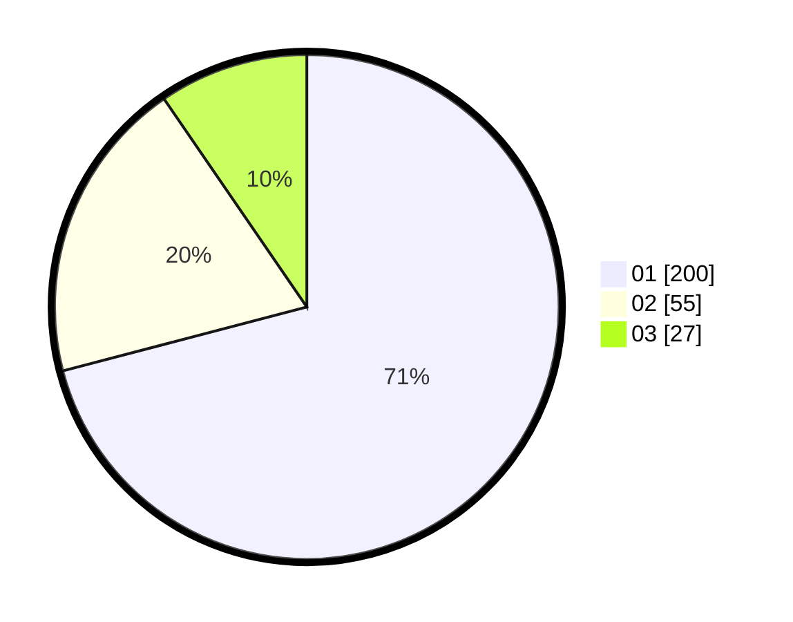

# Hasil

Hasil perolehan suara paslon dapat dilihat pada file paslon-01.txt, paslon-02.txt, dan paslon-03.txt.

Jika tidak ada, artinya data tersebut belum ada pada SIREKAP.

## Perolehan Suara

 * Paslon 01: **200**.
 * Paslon 02: **55**.
 * Paslon 03: **27**.

## Foto C Plano

https://sirekap-obj-formc.kpu.go.id/c2a9/pemilu/ppwp/31/75/07/10/04/3175071004196-20240214-233714--33ae6f52-6532-4b42-aa6b-ff30392c73d7.jpg

https://sirekap-obj-formc.kpu.go.id/c2a9/pemilu/ppwp/31/75/07/10/04/3175071004196-20240214-233731--a21b7f00-5981-4f2e-b3a8-692c6515a206.jpg

https://sirekap-obj-formc.kpu.go.id/c2a9/pemilu/ppwp/31/75/07/10/04/3175071004196-20240214-233748--66437b0a-efff-43ff-acb1-ee04032af333.jpg
