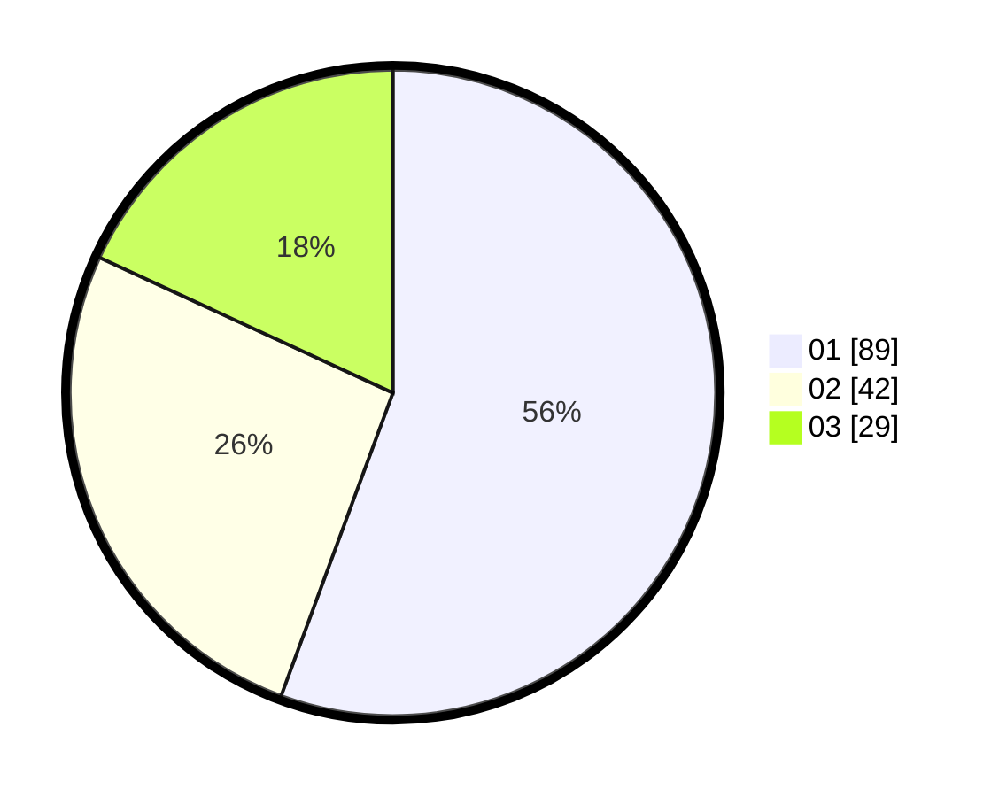

# Hasil

Hasil perolehan suara paslon dapat dilihat pada file paslon-01.txt, paslon-02.txt, dan paslon-03.txt.

Jika tidak ada, artinya data tersebut belum ada pada SIREKAP.

## Perolehan Suara

 * Paslon 01: **89**.
 * Paslon 02: **42**.
 * Paslon 03: **29**.

## Foto C Plano

https://sirekap-obj-formc.kpu.go.id/f783/pemilu/ppwp/31/75/07/10/04/3175071004204-20240214-231918--e566ac1a-7b14-4621-b009-abd58a12ca20.jpg

https://sirekap-obj-formc.kpu.go.id/f783/pemilu/ppwp/31/75/07/10/04/3175071004204-20240214-231730--eb92de90-0586-4f87-94ce-d7bcc11055ef.jpg

https://sirekap-obj-formc.kpu.go.id/f783/pemilu/ppwp/31/75/07/10/04/3175071004204-20240214-232113--5f707e16-4e60-4a28-8383-8ea45da3150a.jpg
