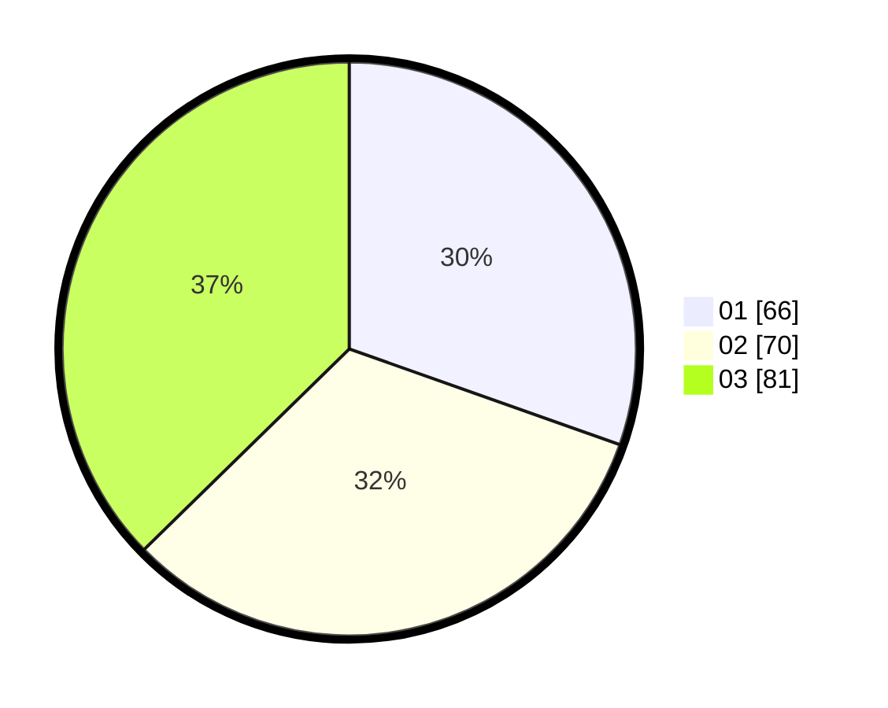

# Hasil

Hasil perolehan suara paslon dapat dilihat pada file paslon-01.txt, paslon-02.txt, dan paslon-03.txt.

Jika tidak ada, artinya data tersebut belum ada pada SIREKAP.

## Perolehan Suara

 * Paslon 01: **66**.
 * Paslon 02: **70**.
 * Paslon 03: **81**.

## Foto C Plano

https://sirekap-obj-formc.kpu.go.id/032b/pemilu/ppwp/31/75/07/10/04/3175071004207-20240214-203138--fbd80bb0-a2f9-418c-9f5d-af8e38caf650.jpg

https://sirekap-obj-formc.kpu.go.id/032b/pemilu/ppwp/31/75/07/10/04/3175071004207-20240214-213445--f4b0177f-96d6-4a7d-a342-7e61d18f799c.jpg

https://sirekap-obj-formc.kpu.go.id/032b/pemilu/ppwp/31/75/07/10/04/3175071004207-20240214-213608--73419b88-daab-4073-b666-a0d45d617e8d.jpg
