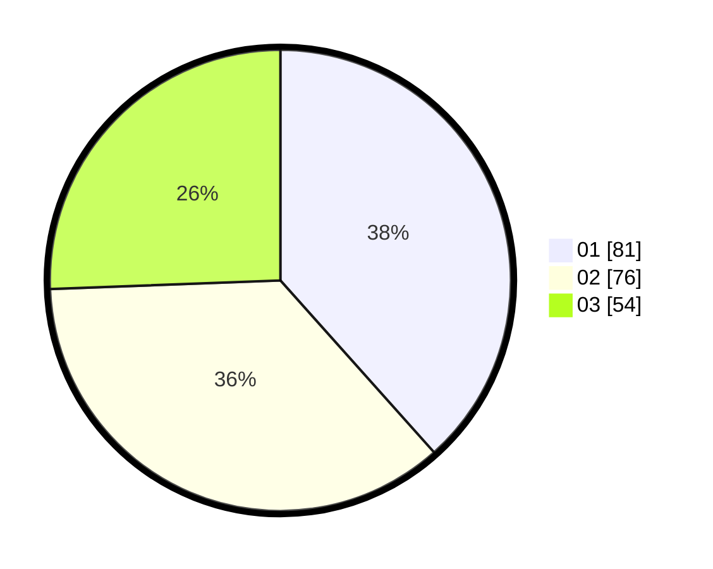

# Hasil

Hasil perolehan suara paslon dapat dilihat pada file paslon-01.txt, paslon-02.txt, dan paslon-03.txt.

Jika tidak ada, artinya data tersebut belum ada pada SIREKAP.

## Perolehan Suara

 * Paslon 01: **81**.
 * Paslon 02: **76**.
 * Paslon 03: **54**.

## Foto C Plano

https://sirekap-obj-formc.kpu.go.id/b3f0/pemilu/ppwp/31/75/07/10/04/3175071004213-20240214-201204--0cfc2780-84b1-4413-98fc-6ff24f660d34.jpg

https://sirekap-obj-formc.kpu.go.id/b3f0/pemilu/ppwp/31/75/07/10/04/3175071004213-20240214-201838--e5b335e5-8ba8-4136-af13-e4b6311ba518.jpg

https://sirekap-obj-formc.kpu.go.id/b3f0/pemilu/ppwp/31/75/07/10/04/3175071004213-20240214-202114--d36aa31f-a6a5-4331-bef1-03ade971894f.jpg

## DATA PEMILIH TETAP

Jumlah pemilih dalam DPT: **270**.
 * L: **125**.
 * P: **145**.

## DATA PENGGUNA HAK PILIH

Jumlah pengguna hak pilih dalam DPT: **207**.
 * L: **94**.
 * P: **113**.

Jumlah pengguna hak pilih dalam DPTb: **9**.
 * L: **3**.
 * P: **6**.

Jumlah pengguna hak pilih dalam DPK: **0**.
 * L: **0**.
 * P: **0**.

Jumlah pengguna hak pilih: **216**.
 * L: **97**.
 * P: **119**.

## JUMLAH SUARA SAH DAN TIDAK SAH

JUMLAH SELURUH SUARA SAH: **211**.

JUMLAH SUARA TIDAK SAH: **5**.

JUMLAH SELURUH SUARA SAH DAN SUARA TIDAK SAH: **216**.
