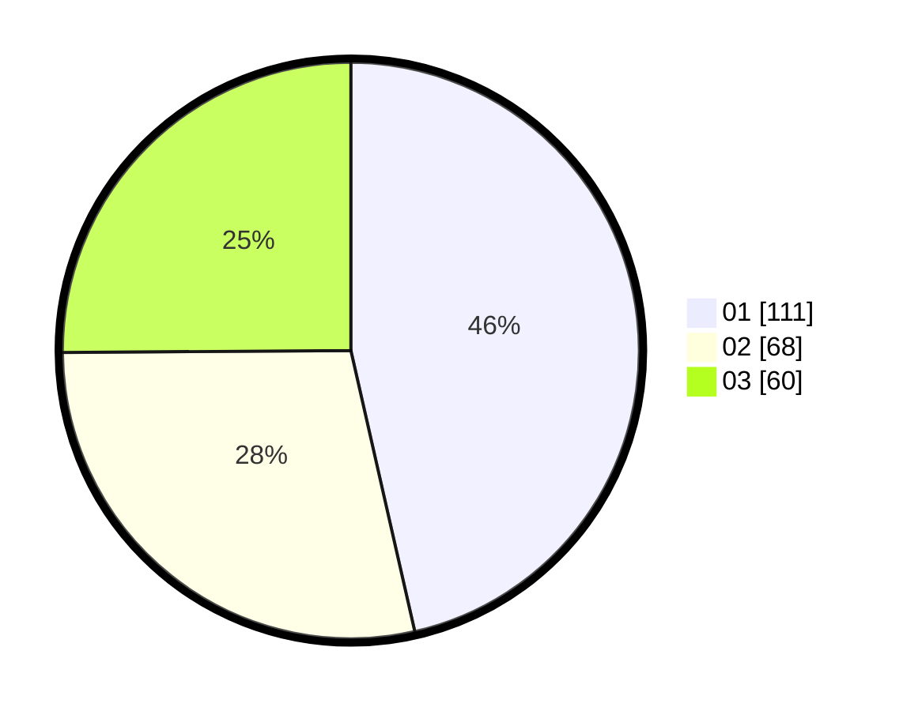

# Hasil

Hasil perolehan suara paslon dapat dilihat pada file paslon-01.txt, paslon-02.txt, dan paslon-03.txt.

Jika tidak ada, artinya data tersebut belum ada pada SIREKAP.

## Perolehan Suara

 * Paslon 01: **111**.
 * Paslon 02: **68**.
 * Paslon 03: **60**.

## Foto C Plano

https://sirekap-obj-formc.kpu.go.id/d388/pemilu/ppwp/31/75/07/10/04/3175071004215-20240214-194411--cabeec1c-d9fa-4a3a-a282-3c1a4fb7af3b.jpg

https://sirekap-obj-formc.kpu.go.id/d388/pemilu/ppwp/31/75/07/10/04/3175071004215-20240214-194427--6b7b2382-04f4-421d-82da-e186497c4fe4.jpg

https://sirekap-obj-formc.kpu.go.id/d388/pemilu/ppwp/31/75/07/10/04/3175071004215-20240214-194434--3914433e-1c01-413e-91d7-2374a8553b93.jpg
