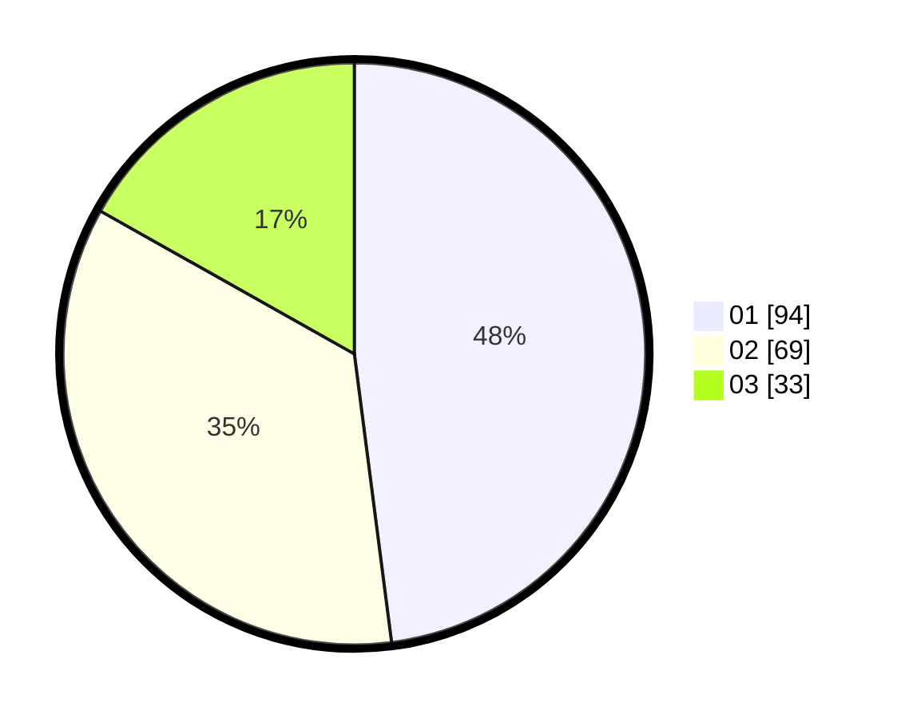

# Hasil

Hasil perolehan suara paslon dapat dilihat pada file paslon-01.txt, paslon-02.txt, dan paslon-03.txt.

Jika tidak ada, artinya data tersebut belum ada pada SIREKAP.

## Perolehan Suara

 * Paslon 01: **94**.
 * Paslon 02: **69**.
 * Paslon 03: **33**.

## Foto C Plano

https://sirekap-obj-formc.kpu.go.id/fa0b/pemilu/ppwp/31/75/07/10/04/3175071004221-20240214-185446--af1e656d-a4af-45ec-9bfc-48c25688919b.jpg

https://sirekap-obj-formc.kpu.go.id/fa0b/pemilu/ppwp/31/75/07/10/04/3175071004221-20240214-184950--d084b6d7-a902-448b-935e-80bad2560361.jpg

https://sirekap-obj-formc.kpu.go.id/fa0b/pemilu/ppwp/31/75/07/10/04/3175071004221-20240216-005723--9edd6e85-bf33-48e2-89d8-837cc77ce263.jpg

## DATA PEMILIH TETAP

Jumlah pemilih dalam DPT: **238**.
 * L: **114**.
 * P: **124**.

## DATA PENGGUNA HAK PILIH

Jumlah pengguna hak pilih dalam DPT: **196**.
 * L: **91**.
 * P: **105**.

Jumlah pengguna hak pilih dalam DPTb: **2**.
 * L: **1**.
 * P: **1**.

Jumlah pengguna hak pilih dalam DPK: **6**.
 * L: **2**.
 * P: **4**.

Jumlah pengguna hak pilih: **204**.
 * L: **94**.
 * P: **110**.

## JUMLAH SUARA SAH DAN TIDAK SAH

JUMLAH SELURUH SUARA SAH: **0**.

JUMLAH SUARA TIDAK SAH: **0**.

JUMLAH SELURUH SUARA SAH DAN SUARA TIDAK SAH: **0**.
