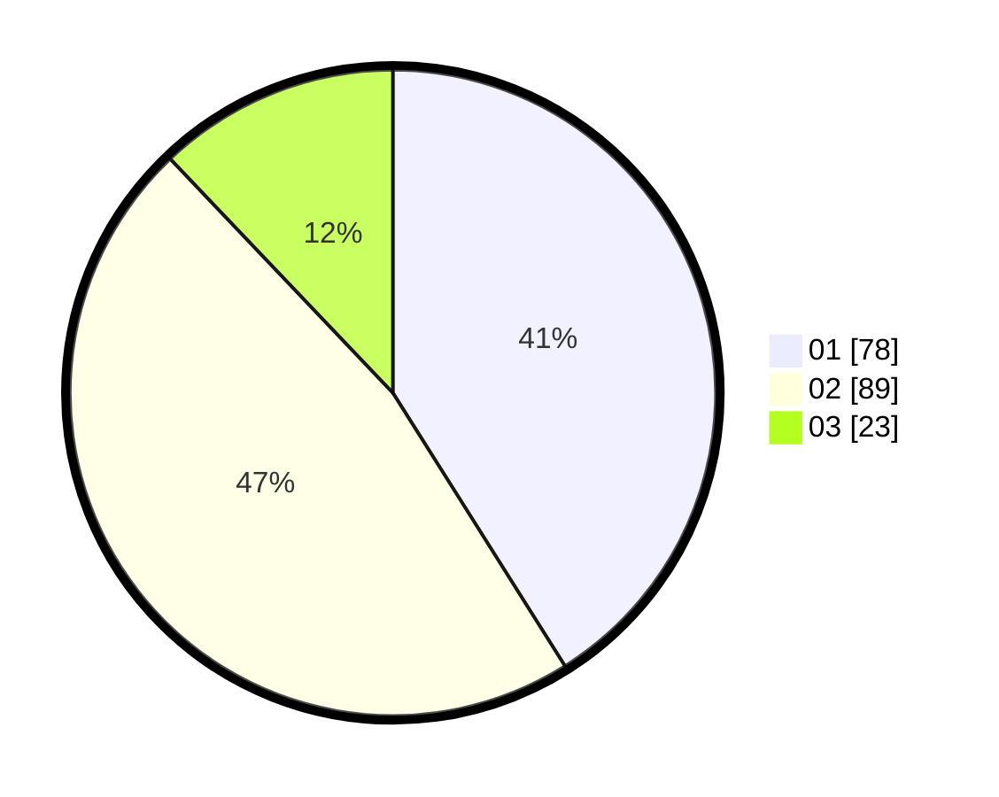

# Hasil

Hasil perolehan suara paslon dapat dilihat pada file paslon-01.txt, paslon-02.txt, dan paslon-03.txt.

Jika tidak ada, artinya data tersebut belum ada pada SIREKAP.

## Perolehan Suara

 * Paslon 01: **78**.
 * Paslon 02: **89**.
 * Paslon 03: **23**.

## Foto C Plano

https://sirekap-obj-formc.kpu.go.id/231f/pemilu/ppwp/31/75/07/10/04/3175071004233-20240214-234938--296324f1-8edb-443b-bbc8-714b2711209c.jpg

https://sirekap-obj-formc.kpu.go.id/231f/pemilu/ppwp/31/75/07/10/04/3175071004233-20240215-000512--fbedccc0-67ea-43c4-aecc-5f1172a0ca12.jpg

https://sirekap-obj-formc.kpu.go.id/231f/pemilu/ppwp/31/75/07/10/04/3175071004233-20240215-000559--ba6a1749-1ffa-49c4-938f-51b5f0c6e6f9.jpg
