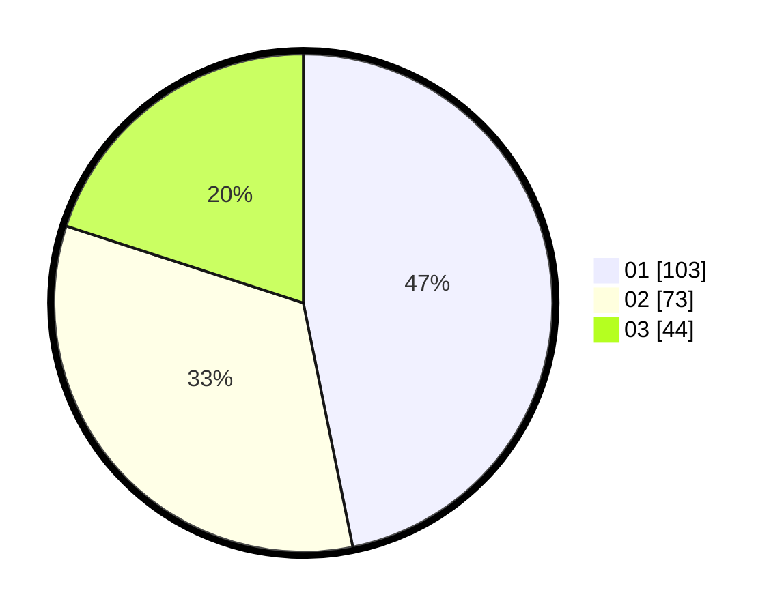

# Hasil

Hasil perolehan suara paslon dapat dilihat pada file paslon-01.txt, paslon-02.txt, dan paslon-03.txt.

Jika tidak ada, artinya data tersebut belum ada pada SIREKAP.

## Perolehan Suara

 * Paslon 01: **103**.
 * Paslon 02: **73**.
 * Paslon 03: **44**.

## Foto C Plano

https://sirekap-obj-formc.kpu.go.id/d2d3/pemilu/ppwp/31/75/07/10/04/3175071004236-20240214-160200--fd1a708e-f151-44ee-8eb5-921047473173.jpg

https://sirekap-obj-formc.kpu.go.id/d2d3/pemilu/ppwp/31/75/07/10/04/3175071004236-20240214-184653--c8c9f3bb-be3d-49bf-875f-796b6c4a4bc9.jpg

https://sirekap-obj-formc.kpu.go.id/d2d3/pemilu/ppwp/31/75/07/10/04/3175071004236-20240214-160058--a261aea9-0570-4edc-9aa5-87ec30d494d6.jpg

## DATA PEMILIH TETAP

Jumlah pemilih dalam DPT: **267**.
 * L: **140**.
 * P: **127**.

## DATA PENGGUNA HAK PILIH

Jumlah pengguna hak pilih dalam DPT: **219**.
 * L: **108**.
 * P: **111**.

Jumlah pengguna hak pilih dalam DPTb: **0**.
 * L: **0**.
 * P: **0**.

Jumlah pengguna hak pilih dalam DPK: **2**.
 * L: **1**.
 * P: **1**.

Jumlah pengguna hak pilih: **221**.
 * L: **109**.
 * P: **112**.

## JUMLAH SUARA SAH DAN TIDAK SAH

JUMLAH SELURUH SUARA SAH: **220**.

JUMLAH SUARA TIDAK SAH: **1**.

JUMLAH SELURUH SUARA SAH DAN SUARA TIDAK SAH: **221**.
