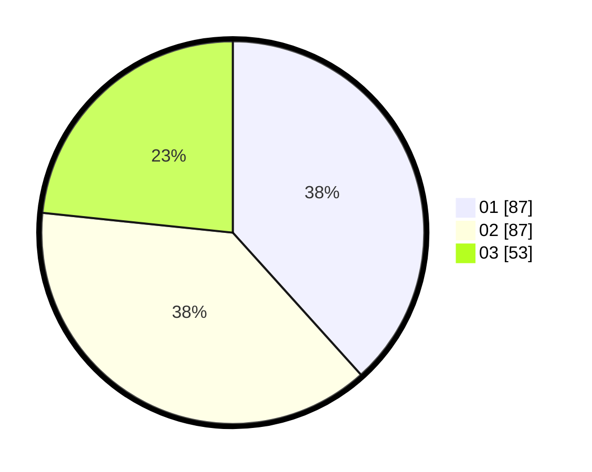

# Hasil

Hasil perolehan suara paslon dapat dilihat pada file paslon-01.txt, paslon-02.txt, dan paslon-03.txt.

Jika tidak ada, artinya data tersebut belum ada pada SIREKAP.

## Perolehan Suara

 * Paslon 01: **87**.
 * Paslon 02: **87**.
 * Paslon 03: **53**.

## Foto C Plano

https://sirekap-obj-formc.kpu.go.id/16d6/pemilu/ppwp/31/75/07/10/04/3175071004239-20240214-184722--81e775f1-8a3a-4ded-b26a-a2ddbc32809c.jpg

https://sirekap-obj-formc.kpu.go.id/16d6/pemilu/ppwp/31/75/07/10/04/3175071004239-20240214-184939--5dd6598f-e69d-470a-9c25-aa936cee8101.jpg

https://sirekap-obj-formc.kpu.go.id/16d6/pemilu/ppwp/31/75/07/10/04/3175071004239-20240214-185038--45c21c72-53e2-4f64-869a-c0ec3efb60d7.jpg

## DATA PEMILIH TETAP

Jumlah pemilih dalam DPT: **265**.
 * L: **121**.
 * P: **144**.

## DATA PENGGUNA HAK PILIH

Jumlah pengguna hak pilih dalam DPT: **223**.
 * L: **100**.
 * P: **123**.

Jumlah pengguna hak pilih dalam DPTb: **0**.
 * L: **0**.
 * P: **0**.

Jumlah pengguna hak pilih dalam DPK: **4**.
 * L: **3**.
 * P: **1**.

Jumlah pengguna hak pilih: **227**.
 * L: **103**.
 * P: **124**.

## JUMLAH SUARA SAH DAN TIDAK SAH

JUMLAH SELURUH SUARA SAH: **227**.

JUMLAH SUARA TIDAK SAH: **0**.

JUMLAH SELURUH SUARA SAH DAN SUARA TIDAK SAH: **227**.
