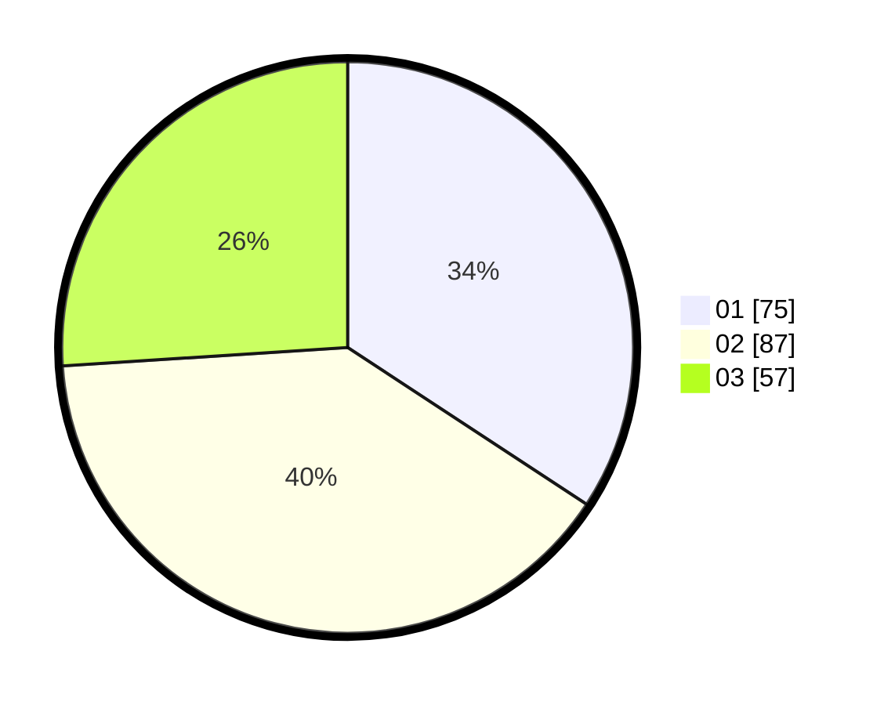

# Hasil

Hasil perolehan suara paslon dapat dilihat pada file paslon-01.txt, paslon-02.txt, dan paslon-03.txt.

Jika tidak ada, artinya data tersebut belum ada pada SIREKAP.

## Perolehan Suara

 * Paslon 01: **75**.
 * Paslon 02: **87**.
 * Paslon 03: **57**.

## Foto C Plano

https://sirekap-obj-formc.kpu.go.id/fb50/pemilu/ppwp/31/75/07/10/04/3175071004240-20240216-024209--31e72047-872d-487c-818c-b6895c99322f.jpg

https://sirekap-obj-formc.kpu.go.id/fb50/pemilu/ppwp/31/75/07/10/04/3175071004240-20240216-024210--ffb31019-fb18-4f3a-9133-e1d818ae6f64.jpg

https://sirekap-obj-formc.kpu.go.id/fb50/pemilu/ppwp/31/75/07/10/04/3175071004240-20240216-024154--44fd5017-ce9c-4440-9f4b-386955373662.jpg

## DATA PEMILIH TETAP

Jumlah pemilih dalam DPT: **282**.
 * L: **131**.
 * P: **151**.

## DATA PENGGUNA HAK PILIH

Jumlah pengguna hak pilih dalam DPT: **282**.
 * L: **131**.
 * P: **151**.

Jumlah pengguna hak pilih dalam DPTb: **0**.
 * L: **0**.
 * P: **0**.

Jumlah pengguna hak pilih dalam DPK: **0**.
 * L: **0**.
 * P: **0**.

Jumlah pengguna hak pilih: **282**.
 * L: **131**.
 * P: **151**.

## JUMLAH SUARA SAH DAN TIDAK SAH

JUMLAH SELURUH SUARA SAH: **219**.

JUMLAH SUARA TIDAK SAH: **2**.

JUMLAH SELURUH SUARA SAH DAN SUARA TIDAK SAH: **221**.
