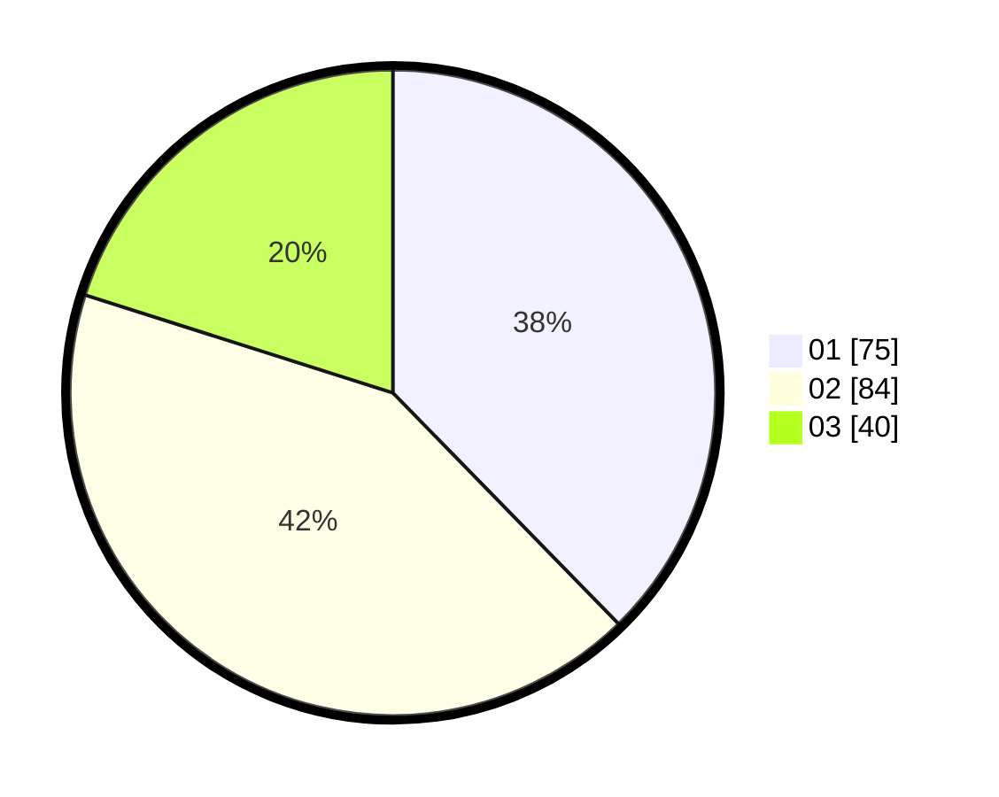

# Hasil

Hasil perolehan suara paslon dapat dilihat pada file paslon-01.txt, paslon-02.txt, dan paslon-03.txt.

Jika tidak ada, artinya data tersebut belum ada pada SIREKAP.

## Perolehan Suara

 * Paslon 01: **75**.
 * Paslon 02: **84**.
 * Paslon 03: **40**.

## Foto C Plano

https://sirekap-obj-formc.kpu.go.id/dd20/pemilu/ppwp/31/75/07/10/04/3175071004243-20240214-233049--7f11e2c6-0684-4834-862d-ba817111bd8a.jpg

https://sirekap-obj-formc.kpu.go.id/dd20/pemilu/ppwp/31/75/07/10/04/3175071004243-20240214-233132--7430308f-e355-4764-ac61-fc49e17cc3b3.jpg

https://sirekap-obj-formc.kpu.go.id/dd20/pemilu/ppwp/31/75/07/10/04/3175071004243-20240214-233302--35bf075f-730f-4ecc-94fe-e80106129158.jpg
