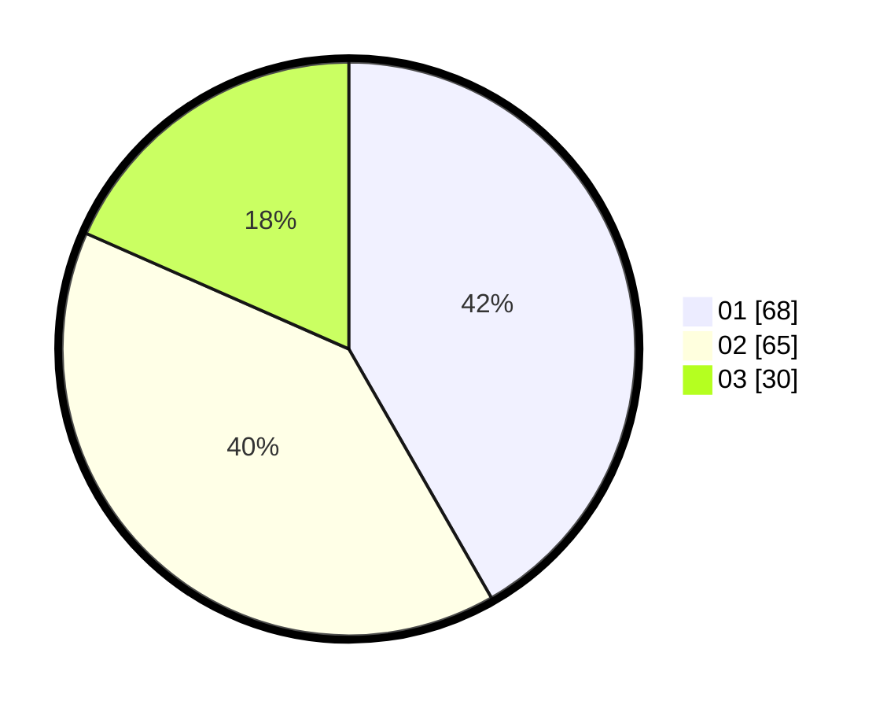

# Hasil

Hasil perolehan suara paslon dapat dilihat pada file paslon-01.txt, paslon-02.txt, dan paslon-03.txt.

Jika tidak ada, artinya data tersebut belum ada pada SIREKAP.

## Perolehan Suara

 * Paslon 01: **68**.
 * Paslon 02: **65**.
 * Paslon 03: **30**.

## Foto C Plano

https://sirekap-obj-formc.kpu.go.id/fff0/pemilu/ppwp/31/75/07/10/04/3175071004246-20240215-045823--e7d983ec-78bd-449c-b8ab-dc782da79886.jpg

https://sirekap-obj-formc.kpu.go.id/fff0/pemilu/ppwp/31/75/07/10/04/3175071004246-20240216-000646--8555920c-5f15-4b08-9650-339257eef36d.jpg

https://sirekap-obj-formc.kpu.go.id/fff0/pemilu/ppwp/31/75/07/10/04/3175071004246-20240216-000925--1d1e3874-a140-44c0-ac27-00ca7e9e1e1c.jpg

## DATA PEMILIH TETAP

Jumlah pemilih dalam DPT: **211**.
 * L: **111**.
 * P: **100**.

## DATA PENGGUNA HAK PILIH

Jumlah pengguna hak pilih dalam DPT: **167**.
 * L: **84**.
 * P: **83**.

Jumlah pengguna hak pilih dalam DPTb: **4**.
 * L: **1**.
 * P: **3**.

Jumlah pengguna hak pilih dalam DPK: **0**.
 * L: **0**.
 * P: **0**.

Jumlah pengguna hak pilih: **171**.
 * L: **85**.
 * P: **86**.

## JUMLAH SUARA SAH DAN TIDAK SAH

JUMLAH SELURUH SUARA SAH: **163**.

JUMLAH SUARA TIDAK SAH: **8**.

JUMLAH SELURUH SUARA SAH DAN SUARA TIDAK SAH: **171**.
