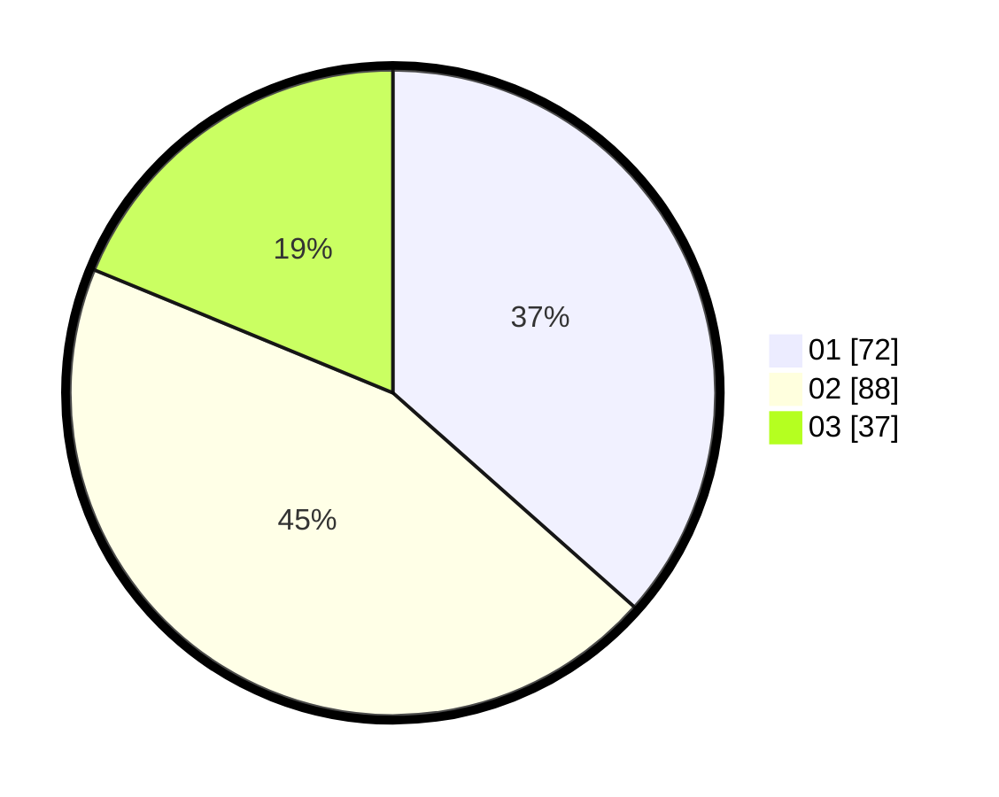

# Hasil

Hasil perolehan suara paslon dapat dilihat pada file paslon-01.txt, paslon-02.txt, dan paslon-03.txt.

Jika tidak ada, artinya data tersebut belum ada pada SIREKAP.

## Perolehan Suara

 * Paslon 01: **72**.
 * Paslon 02: **88**.
 * Paslon 03: **37**.

## Foto C Plano

https://sirekap-obj-formc.kpu.go.id/d6c6/pemilu/ppwp/31/75/07/10/04/3175071004248-20240215-000645--f75bdf6d-1716-471e-aed1-874fa66126b0.jpg

https://sirekap-obj-formc.kpu.go.id/d6c6/pemilu/ppwp/31/75/07/10/04/3175071004248-20240215-000704--5c49594e-179a-440f-b48e-11a777a04df3.jpg

https://sirekap-obj-formc.kpu.go.id/d6c6/pemilu/ppwp/31/75/07/10/04/3175071004248-20240215-000717--9337264c-b8f2-4ad7-907a-d08165c1dd01.jpg
