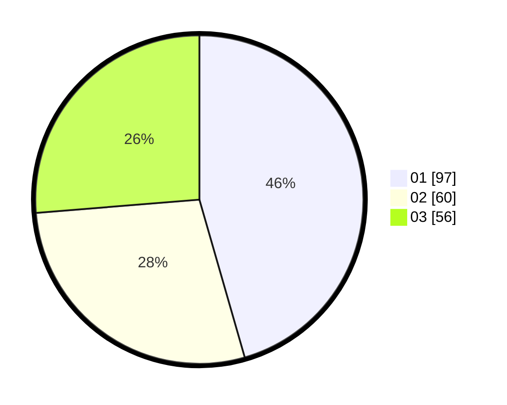

# Hasil

Hasil perolehan suara paslon dapat dilihat pada file paslon-01.txt, paslon-02.txt, dan paslon-03.txt.

Jika tidak ada, artinya data tersebut belum ada pada SIREKAP.

## Perolehan Suara

 * Paslon 01: **97**.
 * Paslon 02: **60**.
 * Paslon 03: **56**.

## Foto C Plano

https://sirekap-obj-formc.kpu.go.id/972a/pemilu/ppwp/31/75/07/10/04/3175071004256-20240215-015947--22c0edf4-9a3c-48d1-9638-521e0bd4fa6c.jpg

https://sirekap-obj-formc.kpu.go.id/972a/pemilu/ppwp/31/75/07/10/04/3175071004256-20240215-010443--15ef42cc-19a2-4029-9ae2-ed12e93c79e6.jpg

https://sirekap-obj-formc.kpu.go.id/972a/pemilu/ppwp/31/75/07/10/04/3175071004256-20240215-015606--02b4feec-4b6c-4a1d-b0bb-28f3b5689095.jpg
