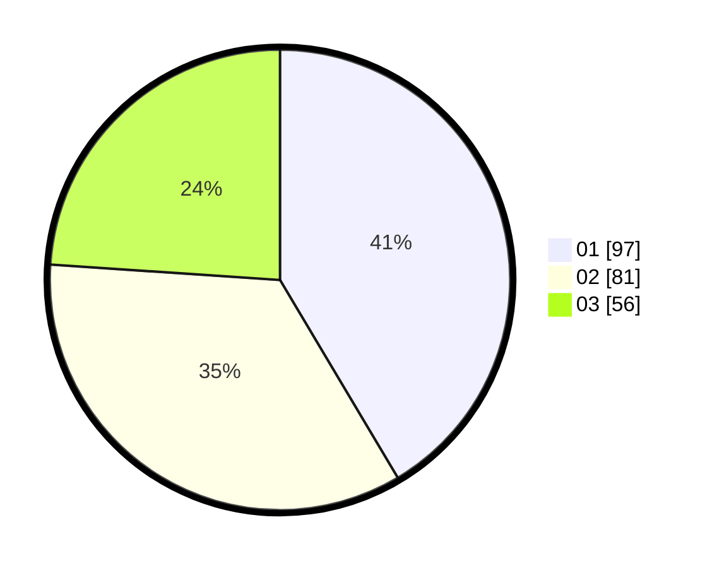

# Hasil

Hasil perolehan suara paslon dapat dilihat pada file paslon-01.txt, paslon-02.txt, dan paslon-03.txt.

Jika tidak ada, artinya data tersebut belum ada pada SIREKAP.

## Perolehan Suara

 * Paslon 01: **97**.
 * Paslon 02: **81**.
 * Paslon 03: **56**.

## Foto C Plano

https://sirekap-obj-formc.kpu.go.id/609c/pemilu/ppwp/31/75/07/10/04/3175071004260-20240214-234028--dc1a86f6-e4b4-4e15-8f85-811517a58569.jpg

https://sirekap-obj-formc.kpu.go.id/609c/pemilu/ppwp/31/75/07/10/04/3175071004260-20240214-234241--3cedd9ce-5de0-4ff1-94c0-4c327d2831a5.jpg

https://sirekap-obj-formc.kpu.go.id/609c/pemilu/ppwp/31/75/07/10/04/3175071004260-20240214-234357--b70a69e6-fe4e-4efd-95e2-4cf721b16bd8.jpg

## DATA PEMILIH TETAP

Jumlah pemilih dalam DPT: **285**.
 * L: **142**.
 * P: **143**.

## DATA PENGGUNA HAK PILIH

Jumlah pengguna hak pilih dalam DPT: **232**.
 * L: **111**.
 * P: **121**.

Jumlah pengguna hak pilih dalam DPTb: **3**.
 * L: **1**.
 * P: **2**.

Jumlah pengguna hak pilih dalam DPK: **3**.
 * L: **2**.
 * P: **1**.

Jumlah pengguna hak pilih: **238**.
 * L: **114**.
 * P: **124**.

## JUMLAH SUARA SAH DAN TIDAK SAH

JUMLAH SELURUH SUARA SAH: **234**.

JUMLAH SUARA TIDAK SAH: **4**.

JUMLAH SELURUH SUARA SAH DAN SUARA TIDAK SAH: **238**.
