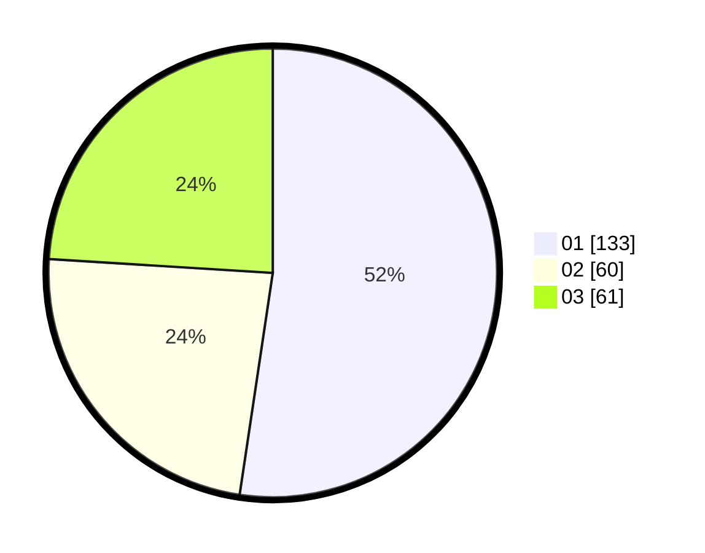

# Hasil

Hasil perolehan suara paslon dapat dilihat pada file paslon-01.txt, paslon-02.txt, dan paslon-03.txt.

Jika tidak ada, artinya data tersebut belum ada pada SIREKAP.

## Perolehan Suara

 * Paslon 01: **133**.
 * Paslon 02: **60**.
 * Paslon 03: **61**.

## Foto C Plano

https://sirekap-obj-formc.kpu.go.id/1d77/pemilu/ppwp/31/75/07/10/05/3175071005007-20240214-211100--1ab3914c-5a6b-4f39-b72b-ab8d56469546.jpg

https://sirekap-obj-formc.kpu.go.id/1d77/pemilu/ppwp/31/75/07/10/05/3175071005007-20240215-000407--a049f684-a398-4562-b911-a70b482d2782.jpg

https://sirekap-obj-formc.kpu.go.id/1d77/pemilu/ppwp/31/75/07/10/05/3175071005007-20240214-213123--2ffb0db6-a2d5-4c1d-97cc-d8a5755a489a.jpg

## DATA PEMILIH TETAP

Jumlah pemilih dalam DPT: **280**.
 * L: **139**.
 * P: **141**.

## DATA PENGGUNA HAK PILIH

Jumlah pengguna hak pilih dalam DPT: **244**.
 * L: **118**.
 * P: **126**.

Jumlah pengguna hak pilih dalam DPTb: **10**.
 * L: **4**.
 * P: **6**.

Jumlah pengguna hak pilih dalam DPK: **3**.
 * L: **3**.
 * P: **0**.

Jumlah pengguna hak pilih: **257**.
 * L: **125**.
 * P: **132**.

## JUMLAH SUARA SAH DAN TIDAK SAH

JUMLAH SELURUH SUARA SAH: **254**.

JUMLAH SUARA TIDAK SAH: **3**.

JUMLAH SELURUH SUARA SAH DAN SUARA TIDAK SAH: **257**.
