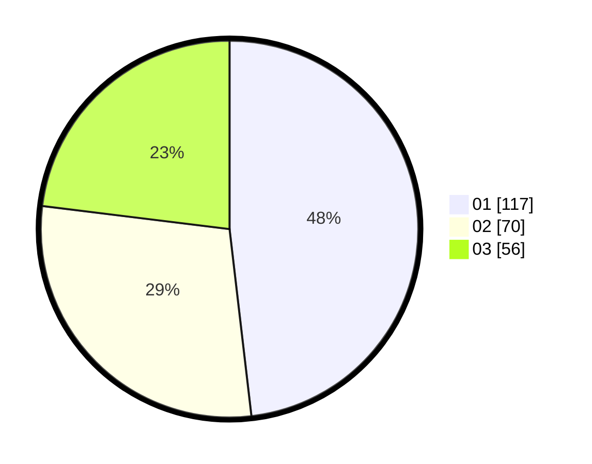

# Hasil

Hasil perolehan suara paslon dapat dilihat pada file paslon-01.txt, paslon-02.txt, dan paslon-03.txt.

Jika tidak ada, artinya data tersebut belum ada pada SIREKAP.

## Perolehan Suara

 * Paslon 01: **117**.
 * Paslon 02: **70**.
 * Paslon 03: **56**.

## Foto C Plano

https://sirekap-obj-formc.kpu.go.id/2f60/pemilu/ppwp/31/75/07/10/05/3175071005010-20240214-154432--eab18895-aa3e-4214-a260-7f503cb58be5.jpg

https://sirekap-obj-formc.kpu.go.id/2f60/pemilu/ppwp/31/75/07/10/05/3175071005010-20240214-154513--5714acf2-d769-462d-bab0-a6bf49d78a2b.jpg

https://sirekap-obj-formc.kpu.go.id/2f60/pemilu/ppwp/31/75/07/10/05/3175071005010-20240214-154537--bfb8523a-0e12-4337-a566-fc1d2d73d5a8.jpg

## DATA PEMILIH TETAP

Jumlah pemilih dalam DPT: **281**.
 * L: **128**.
 * P: **153**.

## DATA PENGGUNA HAK PILIH

Jumlah pengguna hak pilih dalam DPT: **229**.
 * L: **103**.
 * P: **126**.

Jumlah pengguna hak pilih dalam DPTb: **9**.
 * L: **4**.
 * P: **5**.

Jumlah pengguna hak pilih dalam DPK: **8**.
 * L: **4**.
 * P: **4**.

Jumlah pengguna hak pilih: **246**.
 * L: **111**.
 * P: **135**.

## JUMLAH SUARA SAH DAN TIDAK SAH

JUMLAH SELURUH SUARA SAH: **243**.

JUMLAH SUARA TIDAK SAH: **3**.

JUMLAH SELURUH SUARA SAH DAN SUARA TIDAK SAH: **246**.
