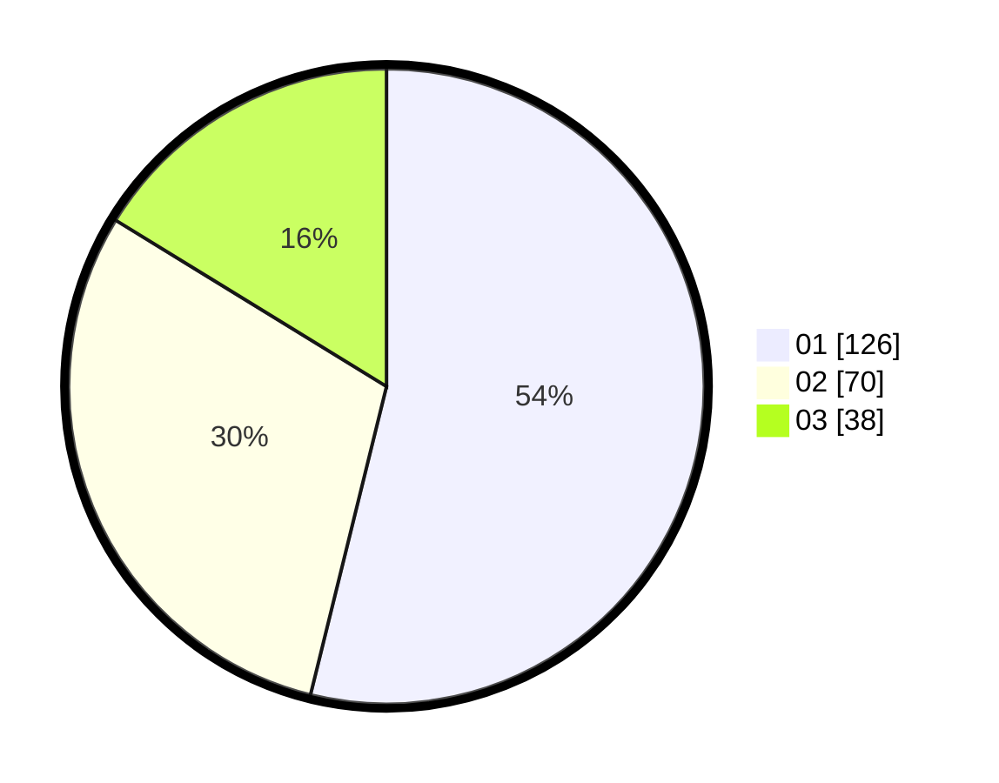

# Hasil

Hasil perolehan suara paslon dapat dilihat pada file paslon-01.txt, paslon-02.txt, dan paslon-03.txt.

Jika tidak ada, artinya data tersebut belum ada pada SIREKAP.

## Perolehan Suara

 * Paslon 01: **126**.
 * Paslon 02: **70**.
 * Paslon 03: **38**.

## Foto C Plano

https://sirekap-obj-formc.kpu.go.id/a35b/pemilu/ppwp/31/75/07/10/05/3175071005012-20240215-092709--a84f4c68-d532-45f7-b75e-6e8134aba5ea.jpg

https://sirekap-obj-formc.kpu.go.id/a35b/pemilu/ppwp/31/75/07/10/05/3175071005012-20240215-092731--37c1081f-c199-4c7c-96c4-a1d94751cd87.jpg

https://sirekap-obj-formc.kpu.go.id/a35b/pemilu/ppwp/31/75/07/10/05/3175071005012-20240215-092720--75286f3d-c4bd-4805-9821-0b6faf2091bb.jpg

## DATA PEMILIH TETAP

Jumlah pemilih dalam DPT: **286**.
 * L: **132**.
 * P: **154**.

## DATA PENGGUNA HAK PILIH

Jumlah pengguna hak pilih dalam DPT: **224**.
 * L: **100**.
 * P: **124**.

Jumlah pengguna hak pilih dalam DPTb: **11**.
 * L: **4**.
 * P: **7**.

Jumlah pengguna hak pilih dalam DPK: **0**.
 * L: **0**.
 * P: **0**.

Jumlah pengguna hak pilih: **235**.
 * L: **104**.
 * P: **131**.

## JUMLAH SUARA SAH DAN TIDAK SAH

JUMLAH SELURUH SUARA SAH: **234**.

JUMLAH SUARA TIDAK SAH: **1**.

JUMLAH SELURUH SUARA SAH DAN SUARA TIDAK SAH: **235**.
