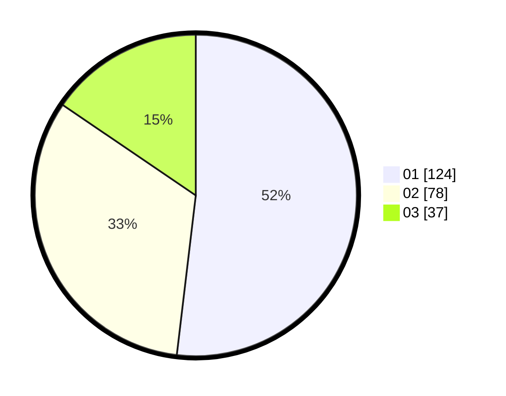

# Hasil

Hasil perolehan suara paslon dapat dilihat pada file paslon-01.txt, paslon-02.txt, dan paslon-03.txt.

Jika tidak ada, artinya data tersebut belum ada pada SIREKAP.

## Perolehan Suara

 * Paslon 01: **124**.
 * Paslon 02: **78**.
 * Paslon 03: **37**.

## Foto C Plano

https://sirekap-obj-formc.kpu.go.id/02d6/pemilu/ppwp/31/75/07/10/05/3175071005013-20240216-142144--741a78b7-db14-4bad-8418-55f5300f84b1.jpg

https://sirekap-obj-formc.kpu.go.id/02d6/pemilu/ppwp/31/75/07/10/05/3175071005013-20240216-142145--56b39a5c-fd6d-4182-b0d4-e11721da10d0.jpg

https://sirekap-obj-formc.kpu.go.id/02d6/pemilu/ppwp/31/75/07/10/05/3175071005013-20240216-142144--4e386382-a93a-42be-8174-5709dd037d0f.jpg

## DATA PEMILIH TETAP

Jumlah pemilih dalam DPT: **286**.
 * L: **142**.
 * P: **144**.

## DATA PENGGUNA HAK PILIH

Jumlah pengguna hak pilih dalam DPT: **239**.
 * L: **114**.
 * P: **125**.

Jumlah pengguna hak pilih dalam DPTb: **1**.
 * L: **0**.
 * P: **1**.

Jumlah pengguna hak pilih dalam DPK: **4**.
 * L: **1**.
 * P: **3**.

Jumlah pengguna hak pilih: **244**.
 * L: **115**.
 * P: **129**.

## JUMLAH SUARA SAH DAN TIDAK SAH

JUMLAH SELURUH SUARA SAH: **239**.

JUMLAH SUARA TIDAK SAH: **5**.

JUMLAH SELURUH SUARA SAH DAN SUARA TIDAK SAH: **244**.
