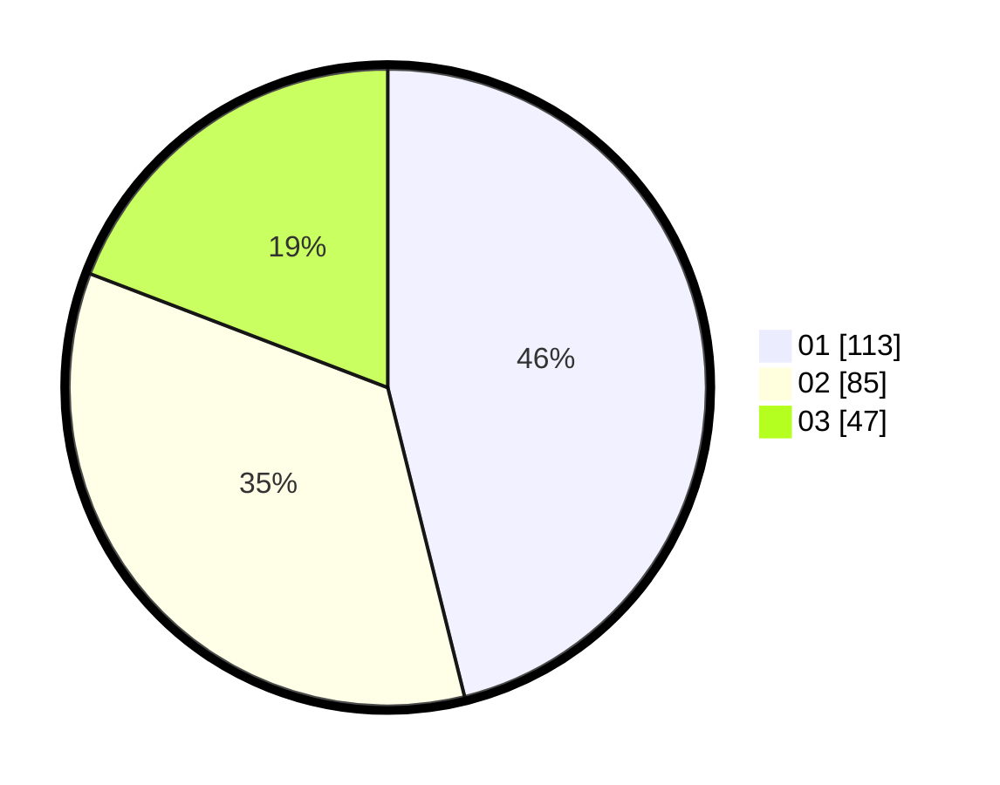

# Hasil

Hasil perolehan suara paslon dapat dilihat pada file paslon-01.txt, paslon-02.txt, dan paslon-03.txt.

Jika tidak ada, artinya data tersebut belum ada pada SIREKAP.

## Perolehan Suara

 * Paslon 01: **113**.
 * Paslon 02: **85**.
 * Paslon 03: **47**.

## Foto C Plano

https://sirekap-obj-formc.kpu.go.id/f95e/pemilu/ppwp/31/75/07/10/05/3175071005016-20240216-153735--9a57f350-6b08-4cbf-a92b-107486e394b3.jpg

https://sirekap-obj-formc.kpu.go.id/f95e/pemilu/ppwp/31/75/07/10/05/3175071005016-20240216-153737--0666b949-3778-44a2-ac1d-88e3c421e0ca.jpg

https://sirekap-obj-formc.kpu.go.id/f95e/pemilu/ppwp/31/75/07/10/05/3175071005016-20240216-153736--14981dd7-935a-4968-8e57-87bd454860ef.jpg

## DATA PEMILIH TETAP

Jumlah pemilih dalam DPT: **293**.
 * L: **141**.
 * P: **152**.

## DATA PENGGUNA HAK PILIH

Jumlah pengguna hak pilih dalam DPT: **244**.
 * L: **111**.
 * P: **133**.

Jumlah pengguna hak pilih dalam DPTb: **0**.
 * L: **0**.
 * P: **0**.

Jumlah pengguna hak pilih dalam DPK: **3**.
 * L: **2**.
 * P: **1**.

Jumlah pengguna hak pilih: **247**.
 * L: **113**.
 * P: **134**.

## JUMLAH SUARA SAH DAN TIDAK SAH

JUMLAH SELURUH SUARA SAH: **245**.

JUMLAH SUARA TIDAK SAH: **2**.

JUMLAH SELURUH SUARA SAH DAN SUARA TIDAK SAH: **247**.
