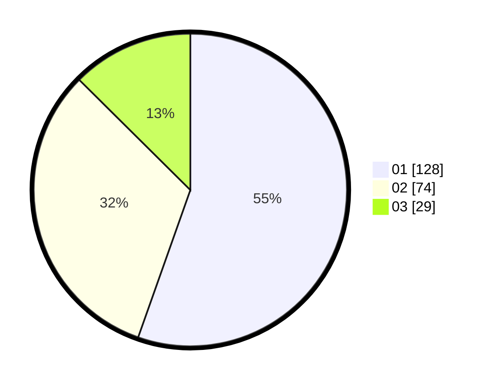

# Hasil

Hasil perolehan suara paslon dapat dilihat pada file paslon-01.txt, paslon-02.txt, dan paslon-03.txt.

Jika tidak ada, artinya data tersebut belum ada pada SIREKAP.

## Perolehan Suara

 * Paslon 01: **128**.
 * Paslon 02: **74**.
 * Paslon 03: **29**.

## Foto C Plano

https://sirekap-obj-formc.kpu.go.id/d01e/pemilu/ppwp/31/75/07/10/05/3175071005017-20240216-092131--1fdeff73-0e54-4332-88e0-76bab63ffb46.jpg

https://sirekap-obj-formc.kpu.go.id/d01e/pemilu/ppwp/31/75/07/10/05/3175071005017-20240216-092132--ec4bebfb-201c-440c-af98-8633a0ffce83.jpg

https://sirekap-obj-formc.kpu.go.id/d01e/pemilu/ppwp/31/75/07/10/05/3175071005017-20240216-092132--497cbec7-0a7e-465d-840b-602110340178.jpg

## DATA PEMILIH TETAP

Jumlah pemilih dalam DPT: **293**.
 * L: **134**.
 * P: **159**.

## DATA PENGGUNA HAK PILIH

Jumlah pengguna hak pilih dalam DPT: **227**.
 * L: **98**.
 * P: **129**.

Jumlah pengguna hak pilih dalam DPTb: **0**.
 * L: **0**.
 * P: **0**.

Jumlah pengguna hak pilih dalam DPK: **7**.
 * L: **3**.
 * P: **4**.

Jumlah pengguna hak pilih: **234**.
 * L: **101**.
 * P: **133**.

## JUMLAH SUARA SAH DAN TIDAK SAH

JUMLAH SELURUH SUARA SAH: **231**.

JUMLAH SUARA TIDAK SAH: **3**.

JUMLAH SELURUH SUARA SAH DAN SUARA TIDAK SAH: **234**.
