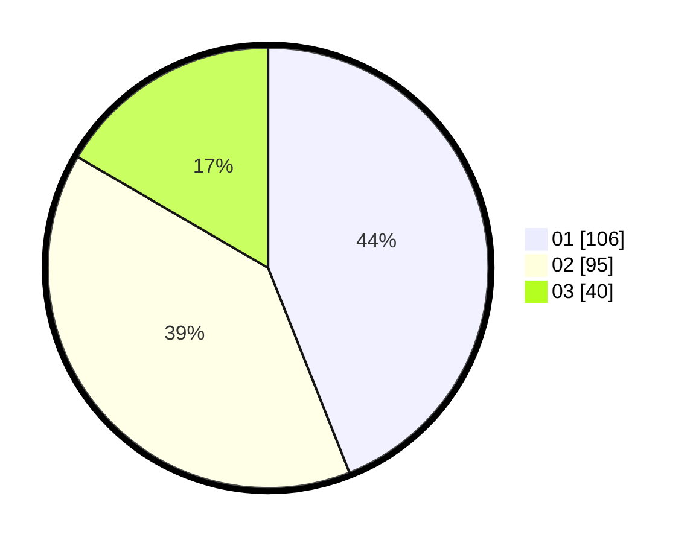

# Hasil

Hasil perolehan suara paslon dapat dilihat pada file paslon-01.txt, paslon-02.txt, dan paslon-03.txt.

Jika tidak ada, artinya data tersebut belum ada pada SIREKAP.

## Perolehan Suara

 * Paslon 01: **106**.
 * Paslon 02: **95**.
 * Paslon 03: **40**.

## Foto C Plano

https://sirekap-obj-formc.kpu.go.id/88cb/pemilu/ppwp/31/75/07/10/05/3175071005018-20240214-224819--da2c247f-0179-41f3-b685-578a0f342e69.jpg

https://sirekap-obj-formc.kpu.go.id/88cb/pemilu/ppwp/31/75/07/10/05/3175071005018-20240214-211752--59601856-d8c2-4adf-bba0-a6b6adc89c7d.jpg

https://sirekap-obj-formc.kpu.go.id/88cb/pemilu/ppwp/31/75/07/10/05/3175071005018-20240214-211838--73850947-f319-43bb-a787-094980409b7c.jpg
