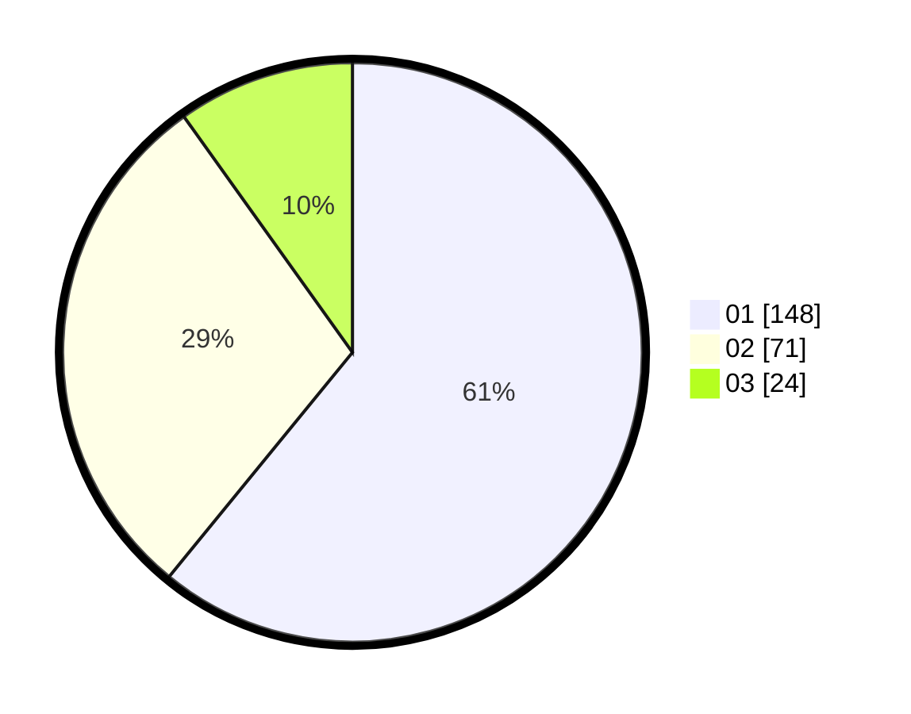

# Hasil

Hasil perolehan suara paslon dapat dilihat pada file paslon-01.txt, paslon-02.txt, dan paslon-03.txt.

Jika tidak ada, artinya data tersebut belum ada pada SIREKAP.

## Perolehan Suara

 * Paslon 01: **148**.
 * Paslon 02: **71**.
 * Paslon 03: **24**.

## Foto C Plano

https://sirekap-obj-formc.kpu.go.id/28be/pemilu/ppwp/31/75/07/10/05/3175071005023-20240216-171119--50e8f9ee-c594-4a7d-b6a2-bd2bc168a22e.jpg

https://sirekap-obj-formc.kpu.go.id/28be/pemilu/ppwp/31/75/07/10/05/3175071005023-20240216-171120--15488b3b-054b-4a7a-8190-8becb215f93d.jpg

https://sirekap-obj-formc.kpu.go.id/28be/pemilu/ppwp/31/75/07/10/05/3175071005023-20240216-171120--c525e163-4561-4b5f-bdf9-763c38367c90.jpg

## DATA PEMILIH TETAP

Jumlah pemilih dalam DPT: **298**.
 * L: **140**.
 * P: **158**.

## DATA PENGGUNA HAK PILIH

Jumlah pengguna hak pilih dalam DPT: **245**.
 * L: **107**.
 * P: **138**.

Jumlah pengguna hak pilih dalam DPTb: **1**.
 * L: **0**.
 * P: **1**.

Jumlah pengguna hak pilih dalam DPK: **0**.
 * L: **0**.
 * P: **0**.

Jumlah pengguna hak pilih: **246**.
 * L: **107**.
 * P: **139**.

## JUMLAH SUARA SAH DAN TIDAK SAH

JUMLAH SELURUH SUARA SAH: **243**.

JUMLAH SUARA TIDAK SAH: **3**.

JUMLAH SELURUH SUARA SAH DAN SUARA TIDAK SAH: **246**.
