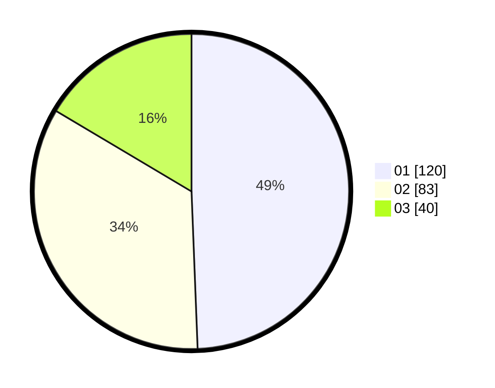

# Hasil

Hasil perolehan suara paslon dapat dilihat pada file paslon-01.txt, paslon-02.txt, dan paslon-03.txt.

Jika tidak ada, artinya data tersebut belum ada pada SIREKAP.

## Perolehan Suara

 * Paslon 01: **120**.
 * Paslon 02: **83**.
 * Paslon 03: **40**.

## Foto C Plano

https://sirekap-obj-formc.kpu.go.id/6d26/pemilu/ppwp/31/75/07/10/05/3175071005033-20240214-184833--f54cafb1-bac5-41df-8813-f28a90a2ec2b.jpg

https://sirekap-obj-formc.kpu.go.id/6d26/pemilu/ppwp/31/75/07/10/05/3175071005033-20240214-185417--502e59c5-083e-440c-be9d-e6624b1d650f.jpg

https://sirekap-obj-formc.kpu.go.id/6d26/pemilu/ppwp/31/75/07/10/05/3175071005033-20240214-185555--3ee060f2-7bf0-4f56-9fa9-d9c2d16ff4f7.jpg

## DATA PEMILIH TETAP

Jumlah pemilih dalam DPT: **287**.
 * L: **136**.
 * P: **151**.

## DATA PENGGUNA HAK PILIH

Jumlah pengguna hak pilih dalam DPT: **243**.
 * L: **112**.
 * P: **131**.

Jumlah pengguna hak pilih dalam DPTb: **1**.
 * L: **0**.
 * P: **1**.

Jumlah pengguna hak pilih dalam DPK: **1**.
 * L: **0**.
 * P: **1**.

Jumlah pengguna hak pilih: **245**.
 * L: **112**.
 * P: **133**.

## JUMLAH SUARA SAH DAN TIDAK SAH

JUMLAH SELURUH SUARA SAH: **243**.

JUMLAH SUARA TIDAK SAH: **2**.

JUMLAH SELURUH SUARA SAH DAN SUARA TIDAK SAH: **245**.
