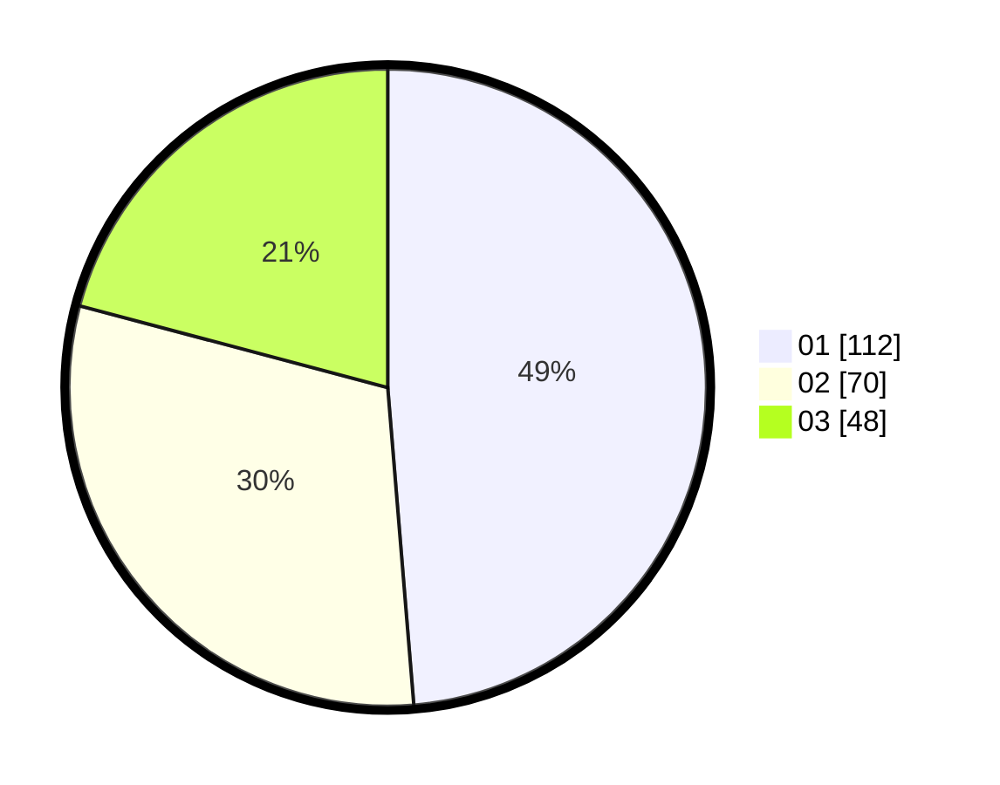

# Hasil

Hasil perolehan suara paslon dapat dilihat pada file paslon-01.txt, paslon-02.txt, dan paslon-03.txt.

Jika tidak ada, artinya data tersebut belum ada pada SIREKAP.

## Perolehan Suara

 * Paslon 01: **112**.
 * Paslon 02: **70**.
 * Paslon 03: **48**.

## Foto C Plano

https://sirekap-obj-formc.kpu.go.id/7816/pemilu/ppwp/31/75/07/10/05/3175071005037-20240214-193142--59a94aa8-74a5-457a-9190-0a76bb9974ee.jpg

https://sirekap-obj-formc.kpu.go.id/7816/pemilu/ppwp/31/75/07/10/05/3175071005037-20240214-193158--c58bdf34-eef9-4c21-9be3-49409c4c076b.jpg

https://sirekap-obj-formc.kpu.go.id/7816/pemilu/ppwp/31/75/07/10/05/3175071005037-20240214-155206--c636ecd6-8465-429c-ac05-c56cb2c0c564.jpg
