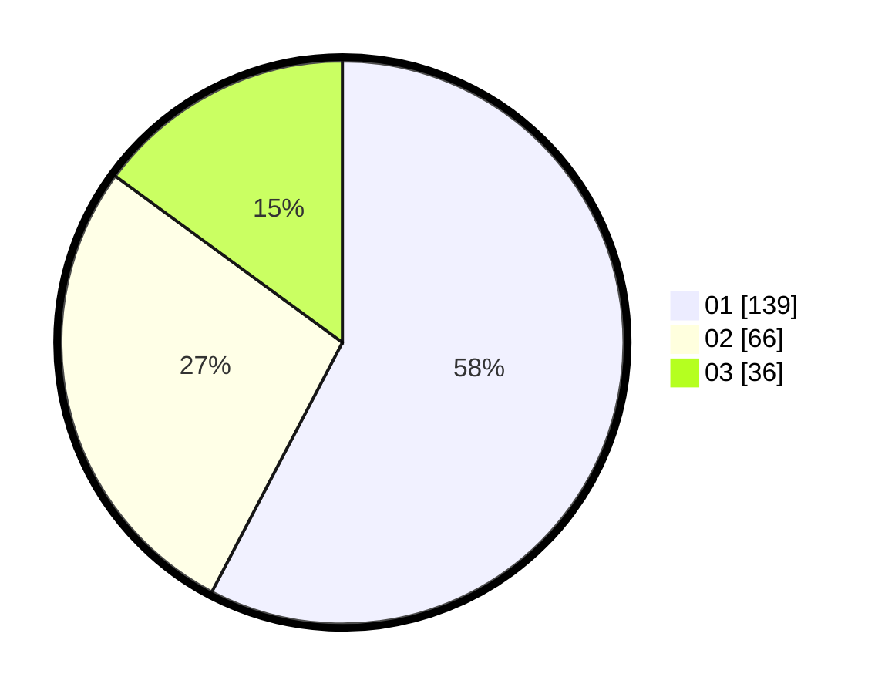

# Hasil

Hasil perolehan suara paslon dapat dilihat pada file paslon-01.txt, paslon-02.txt, dan paslon-03.txt.

Jika tidak ada, artinya data tersebut belum ada pada SIREKAP.

## Perolehan Suara

 * Paslon 01: **139**.
 * Paslon 02: **66**.
 * Paslon 03: **36**.

## Foto C Plano

https://sirekap-obj-formc.kpu.go.id/710b/pemilu/ppwp/31/75/07/10/05/3175071005040-20240214-214954--e8584777-7eef-4aa2-98e5-2b75f6f19411.jpg

https://sirekap-obj-formc.kpu.go.id/710b/pemilu/ppwp/31/75/07/10/05/3175071005040-20240214-215548--2e815181-7623-41d9-8012-abe2143848de.jpg

https://sirekap-obj-formc.kpu.go.id/710b/pemilu/ppwp/31/75/07/10/05/3175071005040-20240214-215810--2e34afa3-1910-488c-8601-a49085c12b23.jpg
