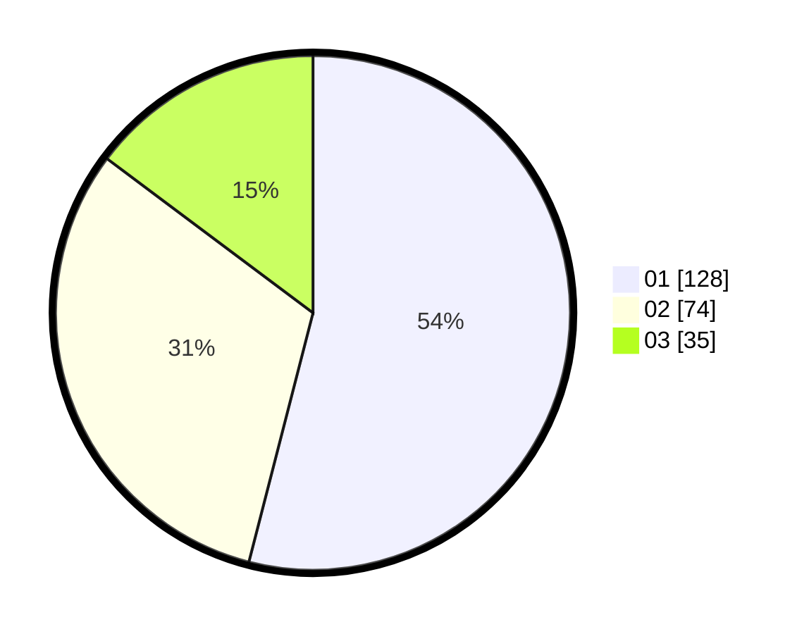

# Hasil

Hasil perolehan suara paslon dapat dilihat pada file paslon-01.txt, paslon-02.txt, dan paslon-03.txt.

Jika tidak ada, artinya data tersebut belum ada pada SIREKAP.

## Perolehan Suara

 * Paslon 01: **128**.
 * Paslon 02: **74**.
 * Paslon 03: **35**.

## Foto C Plano

https://sirekap-obj-formc.kpu.go.id/68fc/pemilu/ppwp/31/75/07/10/05/3175071005043-20240214-200616--21b27584-6666-4367-a29d-0da211432417.jpg

https://sirekap-obj-formc.kpu.go.id/68fc/pemilu/ppwp/31/75/07/10/05/3175071005043-20240214-200702--0491fc7b-10ed-470f-b53f-184eb0e27054.jpg

https://sirekap-obj-formc.kpu.go.id/68fc/pemilu/ppwp/31/75/07/10/05/3175071005043-20240214-200719--c24775b0-68e1-4489-a24d-65913e85d55f.jpg

## DATA PEMILIH TETAP

Jumlah pemilih dalam DPT: **285**.
 * L: **133**.
 * P: **152**.

## DATA PENGGUNA HAK PILIH

Jumlah pengguna hak pilih dalam DPT: **230**.
 * L: **102**.
 * P: **128**.

Jumlah pengguna hak pilih dalam DPTb: **3**.
 * L: **1**.
 * P: **2**.

Jumlah pengguna hak pilih dalam DPK: **4**.
 * L: **1**.
 * P: **3**.

Jumlah pengguna hak pilih: **237**.
 * L: **104**.
 * P: **133**.

## JUMLAH SUARA SAH DAN TIDAK SAH

JUMLAH SELURUH SUARA SAH: **237**.

JUMLAH SUARA TIDAK SAH: **0**.

JUMLAH SELURUH SUARA SAH DAN SUARA TIDAK SAH: **237**.
