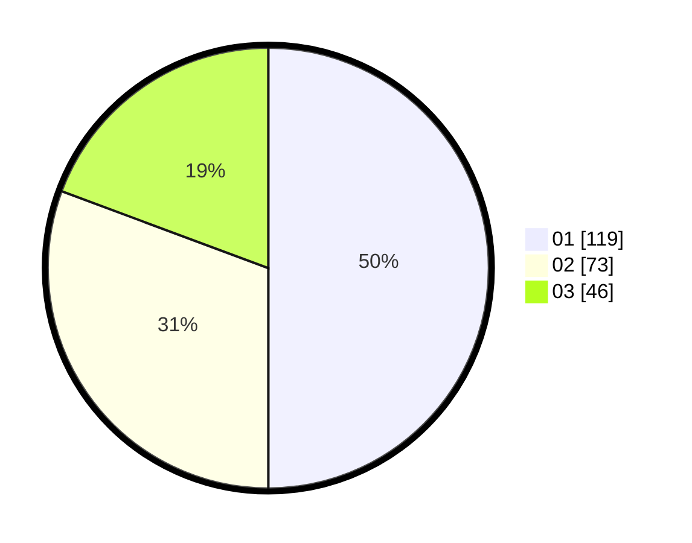

# Hasil

Hasil perolehan suara paslon dapat dilihat pada file paslon-01.txt, paslon-02.txt, dan paslon-03.txt.

Jika tidak ada, artinya data tersebut belum ada pada SIREKAP.

## Perolehan Suara

 * Paslon 01: **119**.
 * Paslon 02: **73**.
 * Paslon 03: **46**.

## Foto C Plano

https://sirekap-obj-formc.kpu.go.id/82bf/pemilu/ppwp/31/75/07/10/05/3175071005044-20240216-172628--c896ac05-040a-4013-b339-645002fa33ec.jpg

https://sirekap-obj-formc.kpu.go.id/82bf/pemilu/ppwp/31/75/07/10/05/3175071005044-20240216-172641--6f6e0276-4fcf-4dc0-8bb7-f68c15d95f89.jpg

https://sirekap-obj-formc.kpu.go.id/82bf/pemilu/ppwp/31/75/07/10/05/3175071005044-20240216-172649--5cd1948f-1df0-428e-a16f-cdd4ddfc45b3.jpg

## DATA PEMILIH TETAP

Jumlah pemilih dalam DPT: **272**.
 * L: **129**.
 * P: **143**.

## DATA PENGGUNA HAK PILIH

Jumlah pengguna hak pilih dalam DPT: **233**.
 * L: **108**.
 * P: **125**.

Jumlah pengguna hak pilih dalam DPTb: **8**.
 * L: **2**.
 * P: **6**.

Jumlah pengguna hak pilih dalam DPK: **3**.
 * L: **2**.
 * P: **1**.

Jumlah pengguna hak pilih: **244**.
 * L: **112**.
 * P: **132**.

## JUMLAH SUARA SAH DAN TIDAK SAH

JUMLAH SELURUH SUARA SAH: **238**.

JUMLAH SUARA TIDAK SAH: **6**.

JUMLAH SELURUH SUARA SAH DAN SUARA TIDAK SAH: **244**.
