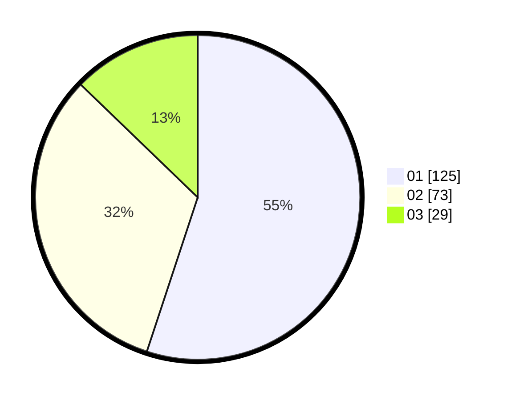

# Hasil

Hasil perolehan suara paslon dapat dilihat pada file paslon-01.txt, paslon-02.txt, dan paslon-03.txt.

Jika tidak ada, artinya data tersebut belum ada pada SIREKAP.

## Perolehan Suara

 * Paslon 01: **125**.
 * Paslon 02: **73**.
 * Paslon 03: **29**.

## Foto C Plano

https://sirekap-obj-formc.kpu.go.id/0f8d/pemilu/ppwp/31/75/07/10/05/3175071005045-20240216-171235--01b1c9dc-c9ed-497d-a08c-2e3bc5740aa5.jpg

https://sirekap-obj-formc.kpu.go.id/0f8d/pemilu/ppwp/31/75/07/10/05/3175071005045-20240216-171236--dfb0fa95-267b-409c-bd6c-911bd88d623a.jpg

https://sirekap-obj-formc.kpu.go.id/0f8d/pemilu/ppwp/31/75/07/10/05/3175071005045-20240216-171236--d698b2e6-a6d5-4a99-bb5b-3956e326ea81.jpg

## DATA PEMILIH TETAP

Jumlah pemilih dalam DPT: **277**.
 * L: **124**.
 * P: **153**.

## DATA PENGGUNA HAK PILIH

Jumlah pengguna hak pilih dalam DPT: **226**.
 * L: **99**.
 * P: **127**.

Jumlah pengguna hak pilih dalam DPTb: **3**.
 * L: **1**.
 * P: **2**.

Jumlah pengguna hak pilih dalam DPK: **2**.
 * L: **2**.
 * P: **0**.

Jumlah pengguna hak pilih: **231**.
 * L: **102**.
 * P: **129**.

## JUMLAH SUARA SAH DAN TIDAK SAH

JUMLAH SELURUH SUARA SAH: **227**.

JUMLAH SUARA TIDAK SAH: **4**.

JUMLAH SELURUH SUARA SAH DAN SUARA TIDAK SAH: **231**.
