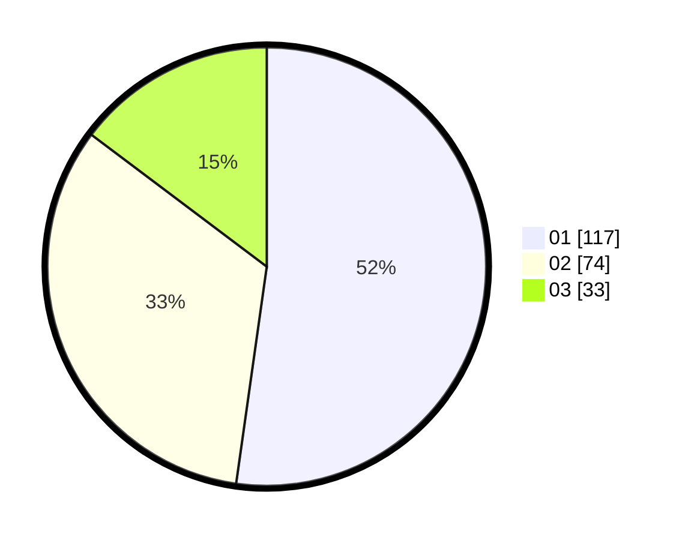

# Hasil

Hasil perolehan suara paslon dapat dilihat pada file paslon-01.txt, paslon-02.txt, dan paslon-03.txt.

Jika tidak ada, artinya data tersebut belum ada pada SIREKAP.

## Perolehan Suara

 * Paslon 01: **117**.
 * Paslon 02: **74**.
 * Paslon 03: **33**.

## Foto C Plano

https://sirekap-obj-formc.kpu.go.id/9bd8/pemilu/ppwp/31/75/07/10/05/3175071005047-20240215-160944--14515226-dc63-4fff-86ce-8497a86996c0.jpg

https://sirekap-obj-formc.kpu.go.id/9bd8/pemilu/ppwp/31/75/07/10/05/3175071005047-20240215-160531--eea6a3ad-97d9-4663-aaca-3e4ba1e0d022.jpg

https://sirekap-obj-formc.kpu.go.id/9bd8/pemilu/ppwp/31/75/07/10/05/3175071005047-20240216-015524--8625c057-1c18-410a-bd23-33b00dc95823.jpg

## DATA PEMILIH TETAP

Jumlah pemilih dalam DPT: **225**.
 * L: **343**.
 * P: **142**.

## DATA PENGGUNA HAK PILIH

Jumlah pengguna hak pilih dalam DPT: **225**.
 * L: **613**.
 * P: **462**.

Jumlah pengguna hak pilih dalam DPTb: **80**.
 * L: **8**.
 * P: **48**.

Jumlah pengguna hak pilih dalam DPK: **800**.
 * L: **848**.
 * P: **880**.

Jumlah pengguna hak pilih: **225**.
 * L: **213**.
 * P: **162**.

## JUMLAH SUARA SAH DAN TIDAK SAH

JUMLAH SELURUH SUARA SAH: **224**.

JUMLAH SUARA TIDAK SAH: **1**.

JUMLAH SELURUH SUARA SAH DAN SUARA TIDAK SAH: **225**.
