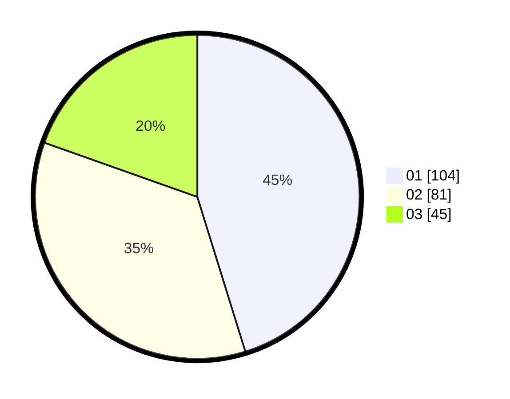

# Hasil

Hasil perolehan suara paslon dapat dilihat pada file paslon-01.txt, paslon-02.txt, dan paslon-03.txt.

Jika tidak ada, artinya data tersebut belum ada pada SIREKAP.

## Perolehan Suara

 * Paslon 01: **104**.
 * Paslon 02: **81**.
 * Paslon 03: **45**.

## Foto C Plano

https://sirekap-obj-formc.kpu.go.id/7324/pemilu/ppwp/31/75/07/10/05/3175071005048-20240217-004026--38ef9002-36b1-4061-92cf-d386d819064b.jpg

https://sirekap-obj-formc.kpu.go.id/7324/pemilu/ppwp/31/75/07/10/05/3175071005048-20240214-191721--4312489d-2b59-4a9b-83ca-75a871996411.jpg

https://sirekap-obj-formc.kpu.go.id/7324/pemilu/ppwp/31/75/07/10/05/3175071005048-20240214-191739--cde52046-3be2-4e81-b225-c7fa42ddb218.jpg

## DATA PEMILIH TETAP

Jumlah pemilih dalam DPT: **272**.
 * L: **124**.
 * P: **148**.

## DATA PENGGUNA HAK PILIH

Jumlah pengguna hak pilih dalam DPT: **223**.
 * L: **102**.
 * P: **121**.

Jumlah pengguna hak pilih dalam DPTb: **3**.
 * L: **1**.
 * P: **2**.

Jumlah pengguna hak pilih dalam DPK: **7**.
 * L: **6**.
 * P: **1**.

Jumlah pengguna hak pilih: **233**.
 * L: **109**.
 * P: **124**.

## JUMLAH SUARA SAH DAN TIDAK SAH

JUMLAH SELURUH SUARA SAH: **230**.

JUMLAH SUARA TIDAK SAH: **3**.

JUMLAH SELURUH SUARA SAH DAN SUARA TIDAK SAH: **233**.
