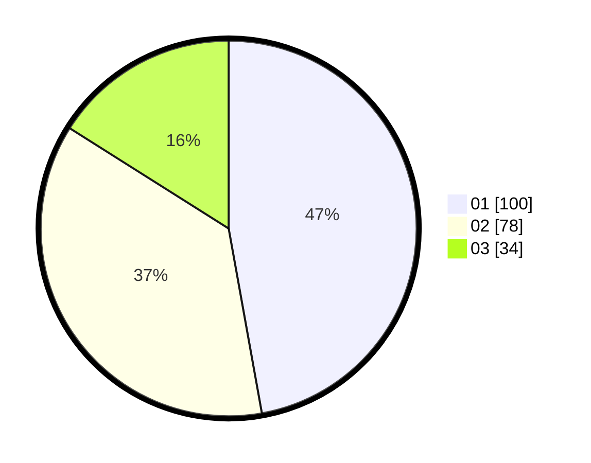

# Hasil

Hasil perolehan suara paslon dapat dilihat pada file paslon-01.txt, paslon-02.txt, dan paslon-03.txt.

Jika tidak ada, artinya data tersebut belum ada pada SIREKAP.

## Perolehan Suara

 * Paslon 01: **100**.
 * Paslon 02: **78**.
 * Paslon 03: **34**.

## Foto C Plano

https://sirekap-obj-formc.kpu.go.id/3585/pemilu/ppwp/31/75/07/10/05/3175071005050-20240214-205733--29e69262-3a14-4db8-b744-bfe704e330ec.jpg

https://sirekap-obj-formc.kpu.go.id/3585/pemilu/ppwp/31/75/07/10/05/3175071005050-20240214-205738--e042e254-486a-40b4-b102-9ab93cd8a70e.jpg

https://sirekap-obj-formc.kpu.go.id/3585/pemilu/ppwp/31/75/07/10/05/3175071005050-20240214-205744--ac4b8dcc-c3b9-4437-91e6-7cf2251418ca.jpg
