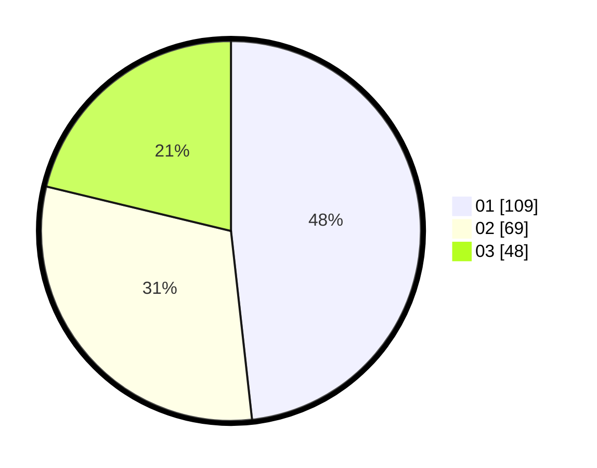

# Hasil

Hasil perolehan suara paslon dapat dilihat pada file paslon-01.txt, paslon-02.txt, dan paslon-03.txt.

Jika tidak ada, artinya data tersebut belum ada pada SIREKAP.

## Perolehan Suara

 * Paslon 01: **109**.
 * Paslon 02: **69**.
 * Paslon 03: **48**.

## Foto C Plano

https://sirekap-obj-formc.kpu.go.id/f9e5/pemilu/ppwp/31/75/07/10/05/3175071005052-20240214-160101--b9ac6f96-6f9c-4fe6-ad76-611f9acc07da.jpg

https://sirekap-obj-formc.kpu.go.id/f9e5/pemilu/ppwp/31/75/07/10/05/3175071005052-20240214-160059--e8b16fb3-e320-4a81-874c-3388e29b1f94.jpg

https://sirekap-obj-formc.kpu.go.id/f9e5/pemilu/ppwp/31/75/07/10/05/3175071005052-20240214-162226--fa6af29a-6fbd-49fa-b365-6a2595d6f726.jpg

## DATA PEMILIH TETAP

Jumlah pemilih dalam DPT: **267**.
 * L: **115**.
 * P: **152**.

## DATA PENGGUNA HAK PILIH

Jumlah pengguna hak pilih dalam DPT: **228**.
 * L: **98**.
 * P: **130**.

Jumlah pengguna hak pilih dalam DPTb: **0**.
 * L: **0**.
 * P: **0**.

Jumlah pengguna hak pilih dalam DPK: **0**.
 * L: **0**.
 * P: **0**.

Jumlah pengguna hak pilih: **228**.
 * L: **98**.
 * P: **130**.

## JUMLAH SUARA SAH DAN TIDAK SAH

JUMLAH SELURUH SUARA SAH: **226**.

JUMLAH SUARA TIDAK SAH: **2**.

JUMLAH SELURUH SUARA SAH DAN SUARA TIDAK SAH: **228**.
