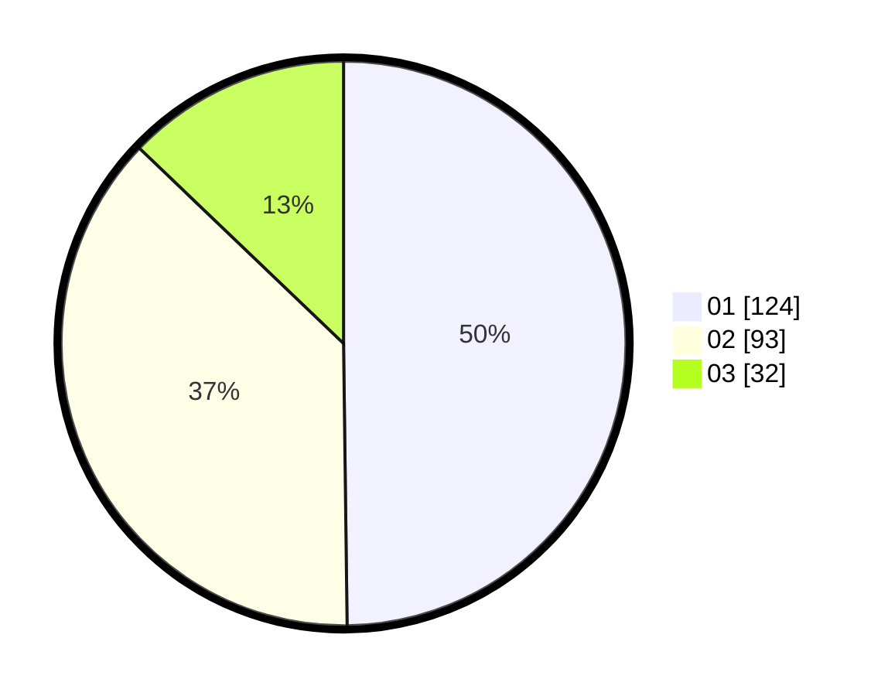

# Hasil

Hasil perolehan suara paslon dapat dilihat pada file paslon-01.txt, paslon-02.txt, dan paslon-03.txt.

Jika tidak ada, artinya data tersebut belum ada pada SIREKAP.

## Perolehan Suara

 * Paslon 01: **124**.
 * Paslon 02: **93**.
 * Paslon 03: **32**.

## Foto C Plano

https://sirekap-obj-formc.kpu.go.id/c941/pemilu/ppwp/31/75/07/10/05/3175071005057-20240214-193126--85a98160-ad9c-4100-baa3-27136866102a.jpg

https://sirekap-obj-formc.kpu.go.id/c941/pemilu/ppwp/31/75/07/10/05/3175071005057-20240214-193243--a8fe9f34-82b9-4276-8d8f-bfa1d83427e3.jpg

https://sirekap-obj-formc.kpu.go.id/c941/pemilu/ppwp/31/75/07/10/05/3175071005057-20240214-193258--743b4eb0-f678-486c-96f6-d9935636687b.jpg

## DATA PEMILIH TETAP

Jumlah pemilih dalam DPT: **280**.
 * L: **131**.
 * P: **149**.

## DATA PENGGUNA HAK PILIH

Jumlah pengguna hak pilih dalam DPT: **245**.
 * L: **113**.
 * P: **132**.

Jumlah pengguna hak pilih dalam DPTb: **0**.
 * L: **0**.
 * P: **0**.

Jumlah pengguna hak pilih dalam DPK: **5**.
 * L: **2**.
 * P: **3**.

Jumlah pengguna hak pilih: **250**.
 * L: **115**.
 * P: **135**.

## JUMLAH SUARA SAH DAN TIDAK SAH

JUMLAH SELURUH SUARA SAH: **249**.

JUMLAH SUARA TIDAK SAH: **1**.

JUMLAH SELURUH SUARA SAH DAN SUARA TIDAK SAH: **250**.
