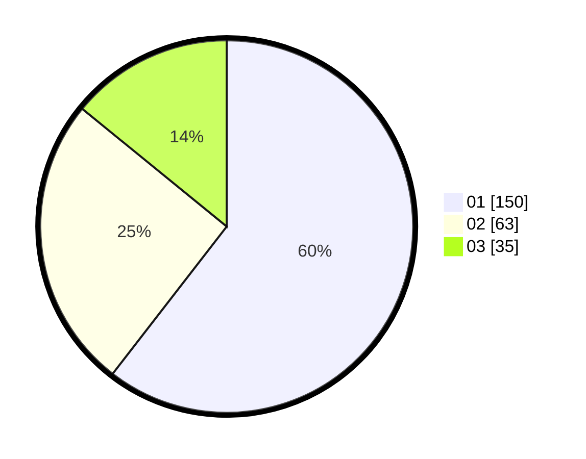

# Hasil

Hasil perolehan suara paslon dapat dilihat pada file paslon-01.txt, paslon-02.txt, dan paslon-03.txt.

Jika tidak ada, artinya data tersebut belum ada pada SIREKAP.

## Perolehan Suara

 * Paslon 01: **150**.
 * Paslon 02: **63**.
 * Paslon 03: **35**.

## Foto C Plano

https://sirekap-obj-formc.kpu.go.id/738a/pemilu/ppwp/31/75/07/10/05/3175071005064-20240214-195815--7f322052-172d-40c9-a227-98edabdb67f2.jpg

https://sirekap-obj-formc.kpu.go.id/738a/pemilu/ppwp/31/75/07/10/05/3175071005064-20240214-195903--81e1b59f-b79a-418b-8836-fae150781e8c.jpg

https://sirekap-obj-formc.kpu.go.id/738a/pemilu/ppwp/31/75/07/10/05/3175071005064-20240214-210309--1580366a-b3a4-43dd-9385-304783e786cd.jpg
