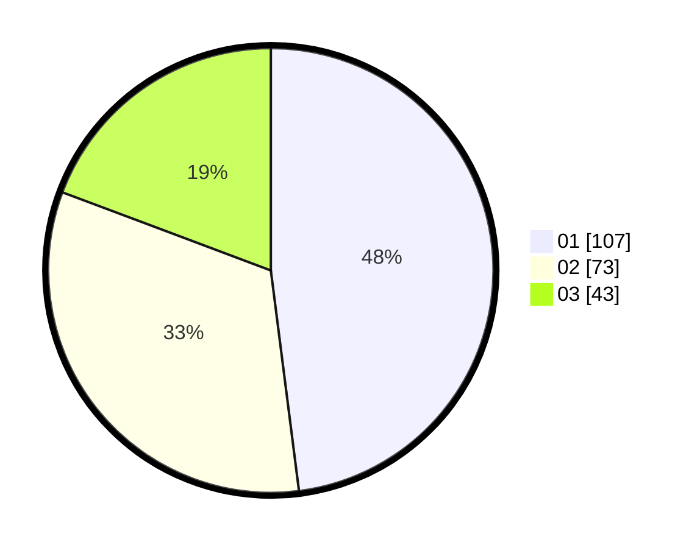

# Hasil

Hasil perolehan suara paslon dapat dilihat pada file paslon-01.txt, paslon-02.txt, dan paslon-03.txt.

Jika tidak ada, artinya data tersebut belum ada pada SIREKAP.

## Perolehan Suara

 * Paslon 01: **107**.
 * Paslon 02: **73**.
 * Paslon 03: **43**.

## Foto C Plano

https://sirekap-obj-formc.kpu.go.id/055b/pemilu/ppwp/31/75/07/10/05/3175071005066-20240214-204550--7bbe8337-8fc2-45a6-9df5-3cf4c7ab05ca.jpg

https://sirekap-obj-formc.kpu.go.id/055b/pemilu/ppwp/31/75/07/10/05/3175071005066-20240214-204647--d1ab8591-e490-44f9-9cc9-a61c0df8604a.jpg

https://sirekap-obj-formc.kpu.go.id/055b/pemilu/ppwp/31/75/07/10/05/3175071005066-20240214-204719--b9c535cd-dfe3-4053-a29b-d5b7e355be98.jpg

## DATA PEMILIH TETAP

Jumlah pemilih dalam DPT: **263**.
 * L: **122**.
 * P: **141**.

## DATA PENGGUNA HAK PILIH

Jumlah pengguna hak pilih dalam DPT: **221**.
 * L: **105**.
 * P: **116**.

Jumlah pengguna hak pilih dalam DPTb: **1**.
 * L: **1**.
 * P: **0**.

Jumlah pengguna hak pilih dalam DPK: **3**.
 * L: **2**.
 * P: **1**.

Jumlah pengguna hak pilih: **225**.
 * L: **108**.
 * P: **117**.

## JUMLAH SUARA SAH DAN TIDAK SAH

JUMLAH SELURUH SUARA SAH: **223**.

JUMLAH SUARA TIDAK SAH: **2**.

JUMLAH SELURUH SUARA SAH DAN SUARA TIDAK SAH: **225**.
